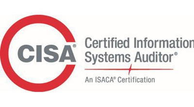
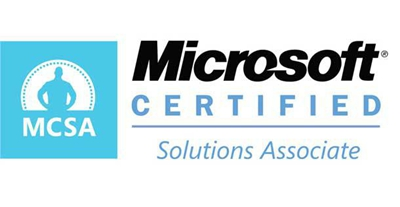
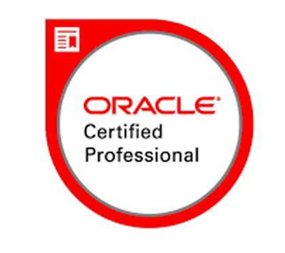

# 其他证书

## `ITIL`=`信息技术基础设施库`

* `ITIL`=`Information Technology Infrastructure Library`=`信息技术基础设施库`
  * 是什么：一个国际通用的IT服务管理方面的认证
    * a IT management framework
  * 作用：帮助每个企业的IT部门完善流程，实现规范化、精细化运作
    * 提供了`ITSM`
      * `ITSM`=`IT Service Management`=`信息技术服务管理`
  * 概述
    * 由`英国商务部`于上个世纪80年代末发展的一套IT服务管理最佳实践指南，它由一系列出版物、各种资格认证及一个国际用户组织（`itSMF`）支持
      * `OGC`=`Office of Government Commerce`=`英国商务部`
    * ITIL致力于协助组织机构建立IT服务管理架构，已经成为全球范围内用得最广泛的IT服务管理最佳实践
    * ITIL自上世纪八十年代开始发展，经过行业专家、顾问和实施者的共同努力，已经成为IT服务管理领域最佳实践事实上的国际标准
      * ITIL经过40年的发展，已经成为IT服务管理领域最好的国际标准
    * ITIL是一种全新的、基于流程的IT管理模式，可快速帮助企业IT部门从职能/后勤部门转型为服务部门，并实现规范、精细、可量化的IT管理，提供可保证的IT服务质量
  * 特点
    * 这个认证站的高度比较高，一般都是倾向管理者的，站在全局的角度考虑自己权限范围内的IT建设的
  * 现状
    * 这个证书目前在外企(欧美企业)中比较流行，特别是大型制造型企业
      * 如果你经常上51JOB之类的招聘网站的话，你会发现`ITIL`在欧美的外企中要求的特别多
    * 全球10,000 多家在各行业处于领先地位的组织都在使用ITIL流程改进IT服务的效率和沟通，大量的成功实践表明实施ITIL可以大幅度提高IT部门营运效率，提高IT组织服务质量
    * 在过去的15 年里，每一次ITIL 的更新对产品和服务支持的内容、质量、以及提供服务的供应商都产生了很大的影响
    * 有这个证书，对于想进外企的人来说，就是一个敲门砖
    * 即使你成为企业的管理者，或者IT部门负责人都是需要ITIL证书的
  * 历史 & 更新
    * 2000：`ITIL 2`=`ITIL v2`
      * 更侧重过程process
    * 2007：`ITIL 3`=`ITIL v3`
      * 2011：小更新
        * 又称：`ITIL 2011 V3`
    * 2019：`ITIL 4`=`ITIL v4`
  * 级别
    * `ITIL v3`
      * 5个等级
        * `ITIL Foundation`=`ITIL基础认证`
          * 获取其他证书的基础，是对ITIL入门者的核心基础认证
            * 只有考取了ITIL foundation证书才能考取更高等级的证
          * 适用于：从事IT服务管理的人员
            * 要求他们了解IT服务管理的和IT基础设施的重要性，掌握服务管理的流程及相互间接口，ITIL的基本概念，ITIL中的十大流程以及各流程之间的关
        * `ITIL Practitioner`=`ITIL从业者认证`
          * 该证书主要是针对从事IT服务管理特定流程的人员，要求其具有一定实践经验
            * 也就是说考取该证书，需要报考人员有IT方面的实践经验。
        * `ITIL Intermediate`=`ITIL中级认证`
        * `ITIL Expert`=`ITIL专家认证`
        * `ITIL Master`=`ITIL大师认证`
          * 最高级别
    * `ITIL v4`
      * 4个等级
        * `ITIL Foundation`
        * `ITIL Managing Professional`=`ITIL MP`=`ITIL职业经理人`
        * `ITIL Strategic Leader`=`ITIL SL`=`ITIL战略领导者`
        * `ITIL Master`=`ITIL大师认证`
      * 不同等级之间的关系
        * 

## `CISA`=`注册信息系统审计师`

* `CISA`=`Certified Information Systems Auditor`=`注册信息系统审计师`
  * 别称
    * `国际信息系统审计师`
      * 原因：是国际的、全球的认证
  * 概述
    * 由`ISACA`=`Information Systems Audit and Control Association`=(国际)`信息系统审计与控制协会`发起
    * 始于1978年
    * 已经成为涵盖信息系统审计、控制与安全等专业领域的全球公认的标准
  * 证书长什么样
    * 
  * CISA考试领域
    * 信息系统的审计流程（占21%）
    * IT治理和管理（占17%）
    * 信息系统的购置、开发和实施（占12%）；
    * 信息系统的运营和业务恢复能力（占23%）
    * 信息资产的保护（占27%）
  * CISA适合哪些人学习？
    * 信息系统审计的从业人员、IT审计师
    * 信息安全经理、IT风险管理、IT内控管理的从业者
    * CIO、IT经理、信息系统的管理人员
    * 财务、经营审计专业人员
    * 企业内部负责信息系统规划、项目管理、研发、运维等工作的从业人员
    * 信息安全咨询顾问、IT管控咨询顾问、IT专业服务提供从业人员
    * CISA应试者
  * 现状
    * CISA名列薪资最高的证书之列。一直以来，CISA以其市场价值持续高居这个排行榜前列
      * CISA被全球范围的企业和专业人士视为IT/IS认证的“黄金标准”
    * 中国获得CISA认证的审计师分布在银行、证券、政府、高端制造业、信息服务业等高端行业内，越来越受到国内各大企事业单位认可
    * 据Global Knowledge预计，到2020年，CISA证书持有者的平均收入将达到132278美元
    * Global Knowledge发现，证书持有者的平均年龄为46.9岁，从事IT审计工作，通常持有3.3个证书

## 红帽RedHat

### `RHCE`=`红帽认证工程师` 和 `RHCT`=`红帽认证技师`

* `RHCE`=`Red Hat Certified Engineer`=`红帽认证工程师`
  * 是什么：指具备以下能力的`红帽认证系统管理员`=`RHCSA`
    * 自动化红帽企业Linux任务
    * 集成红帽新兴技术
    * 实施自动化来提高效率、促进创新
  * 注意
    * 要想获得`RHCE`认证，需要先满足红帽认证系统管理员 (RHCSA) 的要求，然后再通过红帽认证工程师 (RHCE) 考试 (EX300) 才可获得
  * RHCE考试
    * `RHCE`和`RHCT`是以实际操作能力为基础的测试项目，主要考察考生在现场系统中的实际能力
    * 考试内容
      * 第一部分：故障排除和系统维护
        * 时间：2个半小时
      * 第二部分：安装和配置
        * 时间：3个小时
  * 相关
    * 版本
      * RHCE 7版本
      * RHCE 8版本

### `RHCSA`、`RHCE`、`RHCA`

* RHCSA、RHCE、RHCA
  * 名词
    * `RHCA`=红帽认证`架构师`
    * `RHCE`=红帽认证`工程师`
    * `RHCSA`=红帽认证`系统管理员`
  * 阶梯架构
    * 

## `CDP`=`Certified Data Professional`=`数据专业认证`

* `CDP`=`Certified Data Professional`=`数据专业认证`
  * 2015年诞生的一项认证
    * 取代了2004年至2015年由计算机专业技术认证机构（ICCP）提供的数据管理专业认证（CDMP）
  * 证书长什么样
    * 
  * CDP的专业证书领域
    * 业务分析
    * 数据管理
    * 数据仓库
    * 信息系统管理
  * 其他说明
    * 想要获得CDP证书需要参加为期四天的数据管理现场研讨会，并通过书面考试。证书持有者必须通过90分钟的IS（信息系统）核心考试、90分钟的业务核心和数据管理考试以及其他专业化考试
    * 超过一半的CDP证书持有者拥有至少10年的行业经验，四分之一的人有6至10年的行业经验，只有不到22％的人工作经验在6年以下

## `CompTIA A +`

* `CompTIA A +`
  * 概述
    * CompTIA A +认证代表着计算机技术人员的入门级能力，是一个厂商中立的国际认证，涵盖各种技术和操作系统。美国计算机行业协会 (CompTIA- Computing Technology Industry Association)是在全球ICT领域最具影响力的、最大的、全球领先的行业协会，自1982年成立之日起，一直致力于通过各种标准、专业能力、教育和商业解决方案促进信息技术(ICT)产业及相关从业人员的发展
  * 证书长什么样
    * 
  * 考试
    * 持证人员必须通过两项90分钟的考试
      * 一项涵盖移动设备、网络技术、硬件、虚拟化和云计算和网络故障排除
      * 另一项涵盖安装和配置操作系统、安全、软件故障排除和操作步骤
  * 现状
    * 数据显示，2019年北美CompTIA证书持有者的平均工资为93097美元，其中最受欢迎的CompTIA认证是Security +，A +和Network +

## 微软

### `MCSA`=`微软认证解决方案专员`

* `MCSA`=`微软认证解决方案专员`
  * 概述
    * 为入门级工作者设计，证明他们对微软产品、角色和知识领域的熟练程度
    * MCSA认证是许多微软认证解决方案专家（MCSE）认证的基础，这些认证针对的是经验更丰富的IT工作者
  * 证书长什么样
    * 
  * 解释
    * 微软的认证侧重于用户设计和构建技术解决方案的能力。MCSA认证围绕特定角色和专有产品，例如Microsoft Azure、SQL Server、Office 365、SharePoint Server、Skype for Business、Microsoft Dynamics 365、Exchange Server和Windows Server
  * 现状
    * 2019年IT技能和薪酬调查显示，16％的人持有微软认证，其中19％的微软持证者持有MCSA：Windows Server 2008证书，17％持有MCSA：Windows Server 2012证书

### `MTA`=`微软技术专员认证`

* `MTA`=`微软技术专员认证`
  * 概述
    * 一项入门级认证，可验证Microsoft SQL Server，Visual Studio，Windows和Windows Server 2016的基础技术知识
  * 考试
    * 考试的核心能力范围涵盖80%信息专业知识与20%的技能
  * 证书长什么样
    * 
  * 解释
    * MTA认证涉及很多基本技术概念、评估和验证核心技术知识。对于希望进入技术领域的人来说，这是一个很好的起点
  * 现状
    * 调查显示，2019年北美微软证书持有者的平均工资为104127美元。 MTA考试不具备获得微软认证专家（MCP）的资格，也不是获得MCSA或MCSD认证的先决条件

## Oracle

### `Oracle数据库认证`

* `Oracle数据库认证`
  * 概述
    * Oracle认证代表了你对数据库和Java知识和技能的掌握。Oracle数据库设计和SQL编程教授IT从业人员分析复杂的业务场景，设计和创建数据模型，以及使用SQL创建数据库
  * 证书长什么样
    * 
  * 现状
    * Oracle在数据库设计以及SQL和PL/SQL编程方面侧重于数据的组织、管理和使用。数据显示，2019年北美Oracle数据库认证证书持有者的平均工资为116961美元

## `PMP`=`项目管理专业人士资格认证`

* `PMP`=`项目管理专业人士资格认证`
  * 概述
    * 项目管理专业人士资格认证（PMP）是由美国项目管理协会（Project Management Institute(简称PMI)）发起的，严格评估项目管理人员知识技能是否具有高品质的资格认证考试。在决定谁委托重要的组织项目计划时，证书通常是关键的区分因素
  * 证书长什么样
    * 
  * 条件
    * 想要获得认证的个人必须接受35个小时的PMP相关培训。
    * 此外，没有学士学位的人必须具有7500个小时的项目管理经验，拥有学士学位或更高学位的人则需要4500个小时的项目管理经验
  * 现状
    * 数据显示，2020年PMP证书持有者的平均工资为143493美元
    * PMP认证持有者的平均年龄为48.7岁，通常是项目经理，总共持有4.5项证书
