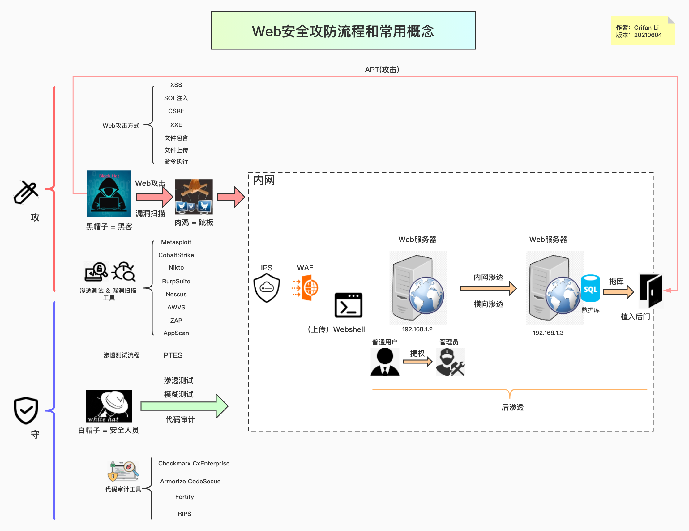
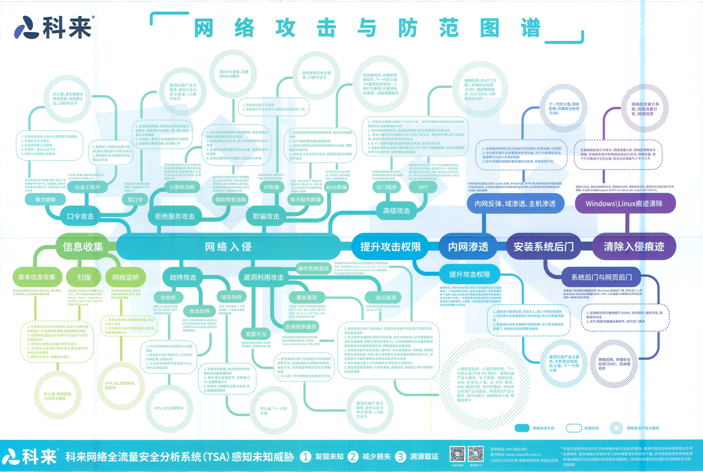

# Web攻防和常见术语

搞Web安全，会遇到很多名词、术语和概念。

现已总结成一张图概览：

* Web安全攻防流程和常用概念
  * 在线浏览
    * [Web安全攻防流程和常用概念 | ProcessOn免费在线作图](https://www.processon.com/view/link/60b9f1b3f346fb5e0b2007bc)
  * 图
    * 

以及别人整理的：

* 网络攻击与防御图谱
  * 
    * 有助于从大体上了解网络攻击的宏观流程和具体涉及内容

## Web安全常见术语和概念

细节详见下面的解释：

## 肉鸡

被黑客入侵并被长期驻扎的计算机或服务器。可以随意控制，可以是任意系统的设备，对象可以是企业，个人，政府等等所有单位

## 抓鸡

利用使用量大的程序的漏洞，使用自动化方式获取肉鸡的行为

## Webshell

通过Web入侵的一种脚本工具，可以据此对网站服务进行一定程度的控制

## 漏洞

硬件、软件、协议等等的可利用安全缺陷，可能被攻击者利用，对数据进行篡改，控制等

### 如何发现漏洞？

典型找到漏洞的方式有：

* 通过`渗透测试`，测出漏洞
* 用`漏洞扫描器`去扫描，找出漏洞

## 木马

通过向服务端提交一句简短的代码，配合本地客户端实现webshell功能的木马

## 提权 = 提升权限

操作系统低权限的账户将自己提升为管理员权限使用的方法

## 后门

黑客为了对主机进行长期的控制，在机器上种植的一段程序或留下的一个`入口`

## 跳板

使用肉鸡IP来实施攻击其他目标，以便更好的隐藏自己的身份信息

## 旁站入侵 ~= 内网渗透

即同服务器下的网站入侵，入侵之后可以通过提权跨目录等手段拿到目标网站的权限。

常见的旁站查询工具有：`WebRobot`、`御剑`、`明小子`和`web在线查询`等

## C段入侵

即同C段下服务器入侵。

比如，目标ip为`192.168.180.253`入侵`192.168.180.*`的任意一台机器，然后利用一些黑客工具嗅探获取在网络上传输的各种信息。

常用的工具有：

* Windows
  * `Cain`
* Linux
  * `Sniffit`
  * `Snoop`
  * `Tcpdump`
  * `Dsniff`

## 测试

### （安全领域中的）黑盒测试 = 不知道源码的攻击 ~= 渗透测试

在未授权的情况下，模拟黑客的攻击方法和思维方式，来评估计算机网络系统可能存在的安全风险。

黑盒测试不同于黑客入侵，并不等于黑站。黑盒测试考验的是综合的能力（`OS`、`Database`、`Script`、`code`、`思路`、`社工`）

思路与经验积累往往决定成败

### （安全领域中的）白盒测试 = 知道源码的测试 ~= 代码审计

相对黑盒测试，白盒测试基本是从内部发起。白盒测试与黑盒测试恰恰相反，测试者可以通过正常渠道向被测单位取得各种资料，包括网络拓扑、员工资料甚至网站或其它程序的代码片断，也能够与单位的其它员工（销售、程序员、管理者……）进行面对面的沟通

### APT攻击

`APT`=`Advanced Persistent Threat`=`高级可持续性攻击`，是指组织(特别是政府)或者小团体利用先进的攻击手段对特定目标进行长期持续性网络攻击的攻击形式

特点：

* 极强的隐蔽性
* 潜伏期长，持续性强
* 目标性强

