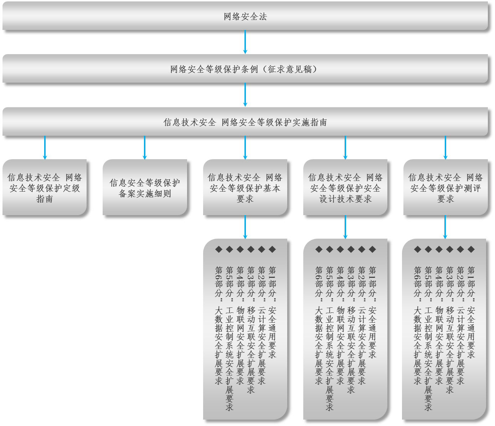
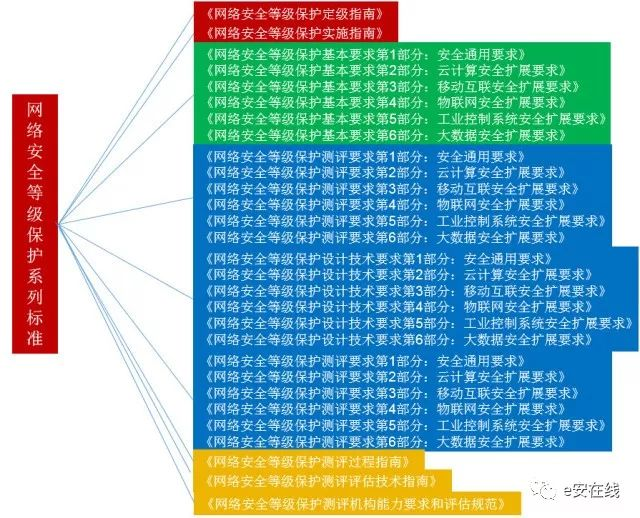
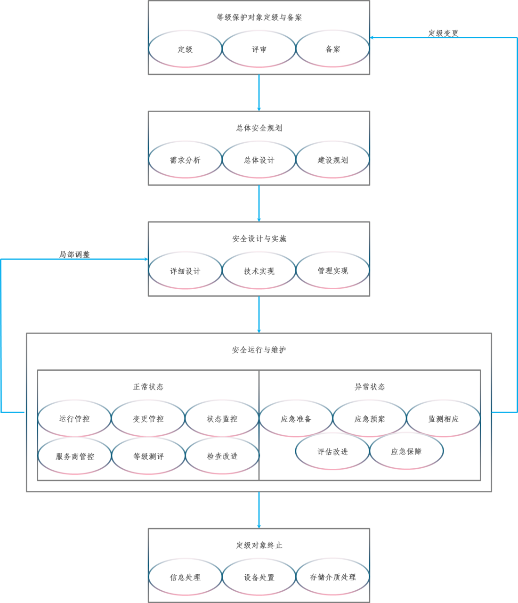
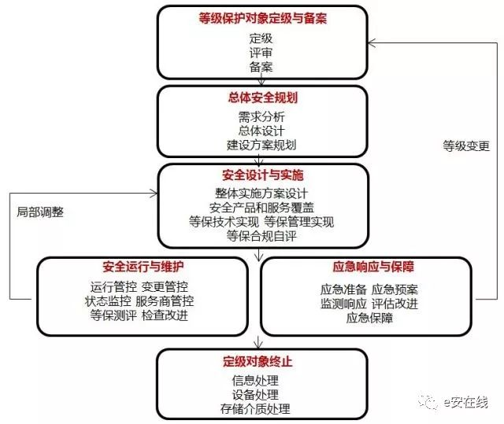
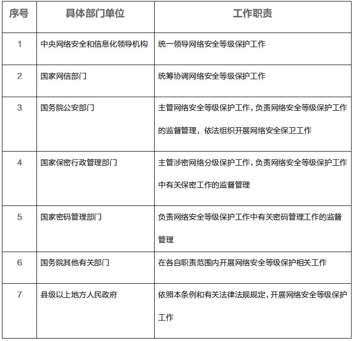
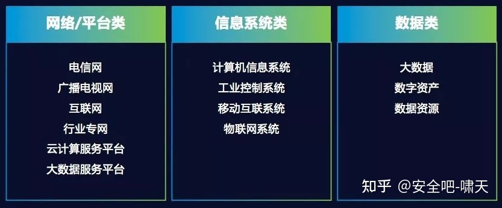
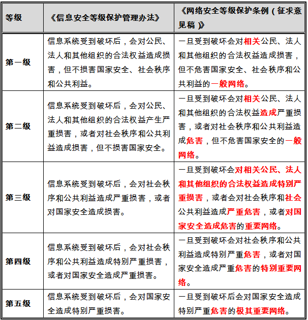
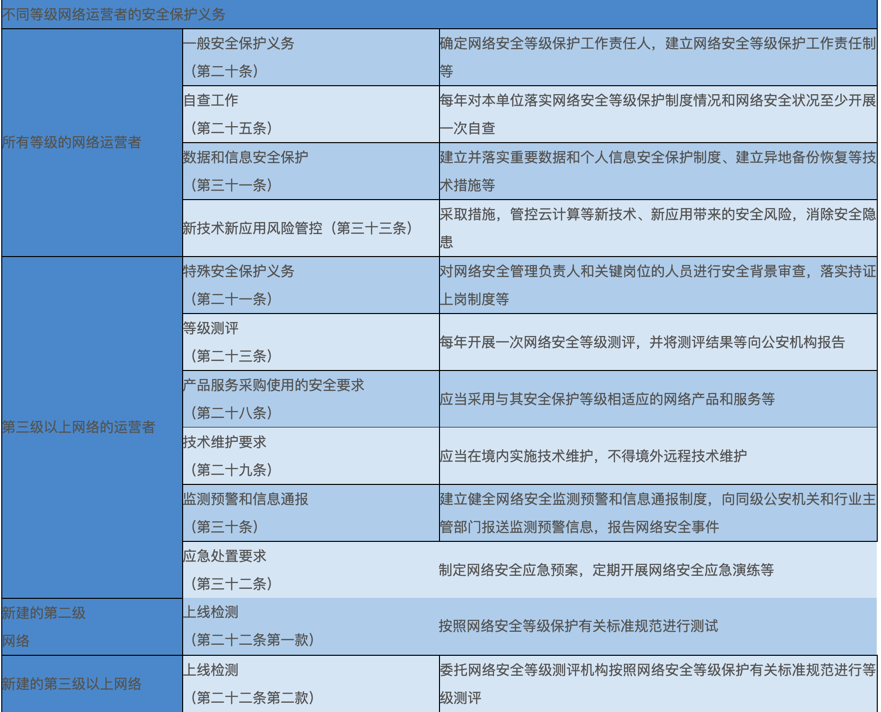
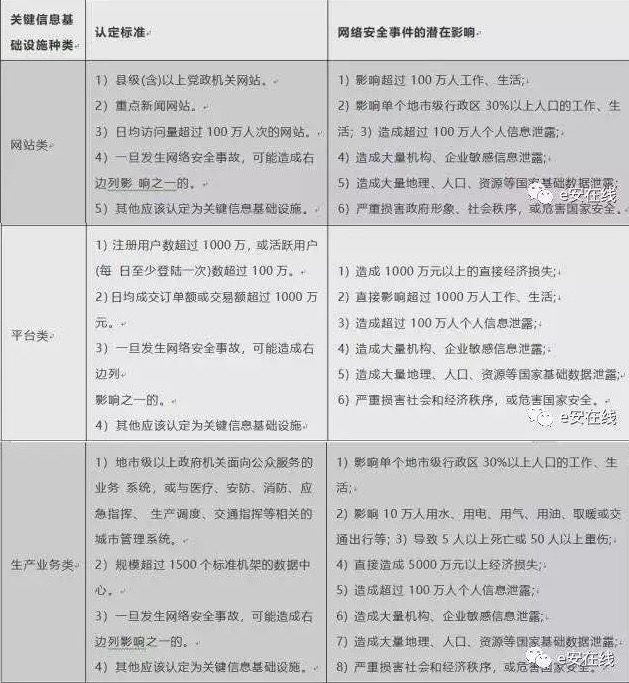

# 网络安全法和等保

此处整理中国的网络安全法律法规。

## 1994年 《计算机信息系统安全保护条例》

* 1994年 国务院 颁布 **《计算机信息系统安全保护条例》** = `147号令`
  * 规定**计算机信息系统**实行`安全等级保护`
    * `安全等级`的划分标准和安全等级保护的具体办法，由公安部会同有关部门制定

## 2007年 等保1.0

* 2007年 **等保1.0**
  * **《信息安全等级保护管理办法》**=**等保1.0**
    * 规定了**信息系统**的安全保护等级划分，及如何开展等级保护的实施与管理工作
    * 等级保护1.0规定了等级保护需要完成的
      * 规定动作
        * 定级备案、建设整改、等级测评和监督检查
    * 为了指导用户完成等级保护的`规定动作`，在2008年至2012年期间陆续发布了等级保护的一些主要标准，构成等级保护1.0的标准体系

### 等级保护1.0 主要标准

* 等级保护1.0时期的主要标准如下
  * 信息安全等级保护管理办法 = =`43号文件` = `上位文件`
  * 计算机信息系统安全保护等级划分准则 = `GB17859-1999` = `上位标准`
  * 信息系统安全等级保护实施指南 = `GB/T25058-2008`
  * 信息系统安全保护等级定级指南 = `GB/T22240-2008`
  * 信息系统安全等级保护基本要求 = `GB/T22239-2008`
    * 业内简称：`等保1.0`
  * 信息系统等级保护安全设计要求 = `GB/T25070-2010`
  * 信息系统安全等级保护测评要求 = `GB/T28448-2012`
  * 信息系统安全等级保护测评过程指南 = `GB/T28449-2012`

## 2017年 网安法

* 2017年 **网安法**
  * 2017年6月1日 **《中华人民共和国网络安全法》**=`网络安全法`=`网安法`
    * 为网络安全等级保护赋予了新的含义，重新调整和修订等级保护1.0标准体系，配合网络安全法的实施和落地，指导用户按照网络安全等级保护制度的新要求，履行网络安全保护义务的意义重大
    * 网络安全法明确
      * 第21条：国家实行网络安全等级保护制度
        * 网络运营者应当按照网络安全等级保护制度的要求，履行一定的安全保护义务，保障网络免受干扰、破坏或者未经授权的访问，防止网络数据泄露或者被窃取、篡改
      * 第31条：国家对一旦遭到破坏、丧失功能或者数据泄露，可能严重危害国家安全、国计民生、公共利益的关键信息基础设施，在网络安全等级保护制度的基础上，实行重点保护
  * 作用：网安法为我国有效应对网络安全威胁和风险、全方位保障网络安全提供了上位法依据
  * 法规内容
    * 章节
      * 第一章　总　　则
      * 第二章　网络安全支持与促进
      * 第三章　网络运行安全
        * 第一节 一般规定
        * 第二节 关键信息基础设施的运行安全
      * 第四章　网络信息安全
      * 第五章　监测预警与应急处置
      * 第六章　法律责任
      * 第七章　附　　则
    * 详见
      * [中华人民共和国网络安全法](http://www.csrc.gov.cn/pub/newsite/flb/flfg/flxzsf/201805/t20180518_338285.html)

## 2018年 网络安全等级保护条例（征求意见稿）

* 2018年 网络安全等级保护条例（征求意见稿）
  * 2018年6月27日，公安部发布
    * **《网络安全等级保护条例（征求意见稿）》**
      * 详见：[公安部关于《网络安全等级保护条例（征求意见稿）》 公开征求意见的公告](http://www.djbh.net/webdev/web/HomeWebAction.do?p=getGzjb&id=8a818256641b29b90164409250320021)
    * 为深入推进实施国家网络安全等级保护制度，公开征求意见

## 2019年 等保2.0

* 2019年 等保2.0
  * 时间：2019年5月13日正式发布，2019年12月1日开始实施

### 等级保护2.0标准体系

* 等级保护2.0标准体系
  * **等保2.0**是**一系列**标准=法规，称为：**标准体系**
  * 概述
    * 1+N模式
      * 1为通用要求，适用各个行业和各个领域
      * N指具体的一个领域内的扩展要求
        * 目前N为5，分别是
          * 云计算
          * 移动互联
          * 物联网
          * 工业控制
          * 大数据
        * 未来随着技术的发展，N会不断扩展
  * 具体包含
    * 其中最核心的是
      * 一个中心，三重防护
        * 一个中心
        * 三重防护
          * 《信息安全技术网络安全等级保护 基本要求》=`GB/T22239-2019`
          * 《信息安全技术网络安全等级保护 测评要求》=`GB/T28448-2019`
          * 《信息安全技术网络安全等级保护 安全设计技术要求》=`GB/T25070-2019`
    * 具体包含
      * 网络安全等级保护条例 = 总要求/上位文件
      * 计算机信息系统安全保护等级划分准则 = 上位标准 = `GB 17859-1999`
      * 网络安全等级保护实施指南 = `GB/T25058-2020`
      * 网络安全等级保护定级指南 = `GB/T22240-2020`
      * 网络安全等级保护基本要求 = `GB/T22239-2019`
        * 业内简称：**等保2.0**
      * 网络安全等级保护设计技术要求 = `GB/T25070-2019`
      * 网络安全等级保护测评要求 = `GB/T28448-2019`
      * 网络安全等级保护测评过程指南 = `GB/T28449-2018`
    * 图 = 等保2.0各标准之间的 关系 = 等保2.0系列标准框架图
      * 
      * 

#### 网络安全等级保护实施指南 = `GB/T25058-2020`

* 网络安全等级保护实施指南 = `GB/T25058-2020`
  * 安全等级保护工作实施的基本流程 = 等级保护2.0工作流程图
    * 
    * 

#### 各国家行业主管或监管部门的监管权力和职责

* 各国家行业主管或监管部门的监管权力和职责具体如下表
  * 

### 等保1.0 vs 等保2.0

* 等保1.0 vs 等保2.0 == 等保2.0的主要变化
  * 名称变化
    * `等保1.0`：《信息安全技术 信息系统安全等级保护基本要求》
    * `等保2.0`：《信息安全技术 网络安全等级保护基本要求》
      * 与《网络安全法》保持一致
  * 定级对象变化
    * `等保1.0`：(狭义的)**信息系统**
    * `等保2.0`：更广
      * 概述
        * 扩展成了等级保护对象（信息系统、通信网络设施和数据资源等）
          * 
      * 包含
        * 信息系统
        * 基础信息网络 = **网络基础设施**
          * 广电网、电信网、专用通信网络等
        * 云计算平台 = **云计算平台/系统**
        * 大数据平台 = **大数据平台/系统**
        * 物联网系统
        * 工业控制系统
        * 采用移动互联技术的网络
      * 评价
        * 基于新技术和新手段提出新的分等级的技术防护机制和完善的管理手段是等级保护2.0标准必须考虑的内容
  * 各级技术要求
    * `等保1.0`：`物理安全`、`网络安全`、`主机安全`、`应用安全`和`数据安全和备份与恢复`
    * `等保2.0`：`安全物理环境`、`安全通信网络`、`安全区域边界`、`安全计算环境`和`安全管理中心`
  * 各级管理要求
    * `等保1.0`：`安全管理制度`、`安全管理机构`、`人员安全管理`、`系统建设管理`和`系统运维管理`
    * `等保2.0`：`安全管理制度`、`安全管理机构`、`安全管理人员`、`安全建设管理`和`安全运维管理`
  * `等保2.0`
    * 新标准强化了密码技术和可信计算技术的使用
      * 把可信验证列入各个级别并逐级提出各个环节的主要可信验证要求，强调通过密码技术、可信验证、安全审计和态势感知等建立主动防御体系的期望
    * 取消了原来安全控制点的S、A、G标注
    * 增加一个附录A
      * `关于安全通用要求和安全扩展要求的选择和使用`
    * 描述等级保护对象的定级结果和安全要求之间的关系
      * 说明如何根据定级的S、A结果选择安全要求的相关条款，简化了标准正文部分的内容
    * 增加附录
      * 附录C：描述等级保护安全框架和关键技术
      * 附录D：描述云计算应用场景
      * 附录E：描述移动互联应用场景
      * 附录F：描述物联网应用场景
      * 附录G：描述工业控制系统应用场景
      * 附录H：描述大数据应用场景

### 安全保护的等级划分

网络安全保护等级（共五级）

| 安全等级 / 划定因素 | 一旦受到破坏 会对相关公民、法人和其他组织的合法权益 造成损害的严重程度 | 对国家安全、 社会秩序和 公共利益的 危害程度 | 网络类型|
| ----------------- | -------------------------------------------------------- | ----------------------------------| ------- |
| 第一级 | 损害 | 不会危害 | 一般网络 |
| 第二级 | 严重损害 | 对社会秩序和公共利益危害／ 不会危害国家安全 | 一般网络 |
| 第三级 | 特别严重损害 | 严重危害 | 重要网络 |
| 第四级 |  | 社会秩序和公共利益特别严重危害／ 对国家安全造成严重危害 | 特别重要网络 |
| 第五级 |  | 对国家安全造成特别严重危害 | 极其重要网络 |

### 等保2.0 主要标准的框架和内容

* 等保2.0 主要标准的框架和内容
  * 主要标准的框架和内容
    * 标准的框架结构
      * 《GB/T 22239-2019》、《GB/T 25070-2019》和《GB/T28448-2019》三个标准采取了统一的框架结构
      * 安全通用要求细分为技术要求和管理要求。其中技术要求包括`安全物理环境`、`安全通信网络`、`安全区域边界`、`安全计算环境`和`安全管理中心`；管理要求包括`安全管理制度`、`安全管理机构`、`安全管理人员`、`安全建设管理`和`安全运维管理`
    * 安全通用要求
      * 安全通用要求针对共性化保护需求提出，无论等级保护对象以何种形式出现，需要根据安全保护等级实现相应级别的安全通用要求。安全扩展要求针对个性化保护需求提出，等级保护对象需要根据安全保护等级、使用的特定技术或特定的应用场景实现安全扩展要求。等级保护对象的安全保护需要同时落实安全通用要求和安全扩展要求提出的措施
        * 安全物理环境
          * 针对物理机房提出的安全控制要求。主要对象为物理环境、物理设备和物理设施等；涉及的安全控制点包括物理位置的选择、物理访问控制、防盗窃和防破坏、防雷击、防火、防水和防潮、防静电、温湿度控制、电力供应和电磁防护
        * 安全通信网络
          * 针对通信网络提出的安全控制要求。主要对象为广域网、城域网和局域网等；涉及的安全控制点包括网络架构、通信传输和可信验证。
        * 安全区域边界
          * 针对网络边界提出的安全控制要求。主要对象为系统边界和区域边界等；涉及的安全控制点包括边界防护、访问控制、入侵防范、恶意代码防范、安全审计和可信验证
        * 安全计算环境
          * 针对边界内部提出的安全控制要求。主要对象为边界内部的所有对象，包括网络设备、安全设备、服务器设备、终端设备、应用系统、数据对象和其他设备等；涉及的安全控制点包括身份鉴别、访问控制、安全审计、入侵防范、恶意代码防范、可信验证、数据完整性、数据保密性、数据备份与恢复、剩余信息保护和个人信息保护
        * 安全管理中心
          * 针对整个系统提出的安全管理方面的技术控制要求，通过技术手段实现集中管理；涉及的安全控制点包括系统管理、审计管理、安全管理和集中管控
        * 安全管理制度
          * 针对整个管理制度体系提出的安全控制要求，涉及的安全控制点包括安全策略、管理制度、制定和发布以及评审和修订
        * 安全管理机构
          * 针对整个管理组织架构提出的安全控制要求，涉及的安全控制点包括岗位设置、人员配备、授权和审批、沟通和合作以及审核和检查
        * 安全管理人员
          * 针对人员管理提出的安全控制要求，涉及的安全控制点包括人员录用、人员离岗、安全意识教育和培训以及外部人员访问管理
        * 安全建设管理
          * 针对安全建设过程提出的安全控制要求，涉及的安全控制点包括定级和备案、安全方案设计、安全产品采购和使用、自行软件开发、外包软件开发、工程实施、测试验收、系统交付、等级测评和服务供应商管理
        * 安全运维管理
          * 针对安全运维过程提出的安全控制要求，涉及的安全控制点包括环境管理、资产管理、介质管理、设备维护管理、漏洞和风险管理、网络和系统安全管理、恶意代码防范管理、配置管理、密码管理、变更管理、备份与恢复管理、安全事件处置、应急预案管理和外包运维管理
    * 安全扩展要求
      * 安全扩展要求是采用特定技术或特定应用场景下的等级保护对象需要增加实现的安全要求。《GB/T 22239-2019》提出的安全扩展要求包括云计算安全扩展要求、移动互联安全扩展要求、物联网安全扩展要求和工业控制系统安全扩展要求
        * 云计算安全扩展要求是针对云计算平台提出的安全通用要求之外额外需要实现的安全要求。主要内容包括`基础设施的位置`、`虚拟化安全保护`、`镜像和快照保护`、`云计算环境管理`和`云服务商选择`等
        * 移动互联安全扩展要求是针对移动终端、移动应用和无线网络提出的安全要求，与安全通用要求一起构成针对采用移动互联技术的等级保护对象的完整安全要求。主要内容包括`无线接入点的物理位置`、`移动终端管控`、`移动应用管控`、`移动应用软件采购`和`移动应用软件开发`等
        * 物联网安全扩展要求是针对感知层提出的特殊安全要求，与安全通用要求一起构成针对物联网的完整安全要求。主要内容包括`感知节点的物理防护`、`感知节点设备安全`、`网关节点设备安全`、`感知节点的管理`和`数据融合处理`等
        * 工业控制系统安全扩展要求主要是针对现场控制层和现场设备层提出的特殊安全要求，它们与安全通用要求一起构成针对工业控制系统的完整安全要求。主要内容包括`室外控制设备防护`、`工业控制系统网络架构安全`、`拨号使用控制`、`无线使用控制`和`控制设备安全`等

### 不同等级网络运营者的安全保护义务

### 网络安全法相关解析

#### 网络安全法明确等级保护工作重点

* `网络安全法`中`等级保护`相关解析
  * 《网络安全法》第二十一条说明如下：
    * > 第二十一条 国家实行网络安全等级保护制度。网络运营者应当按照网络安全等级保护制度的要求，履行下列安全保护义务，保障网络免受干扰、破坏或者未经授权的访问，防止网络数据泄露或者被窃取、篡改：
    * 解读：本条规定的是网络运营者的义务。条款提到的网络安全等级保护制度与公安部运营多年的信息系统安全等级保护制度（即等级保护1.0）有非常大的关联，也说明国家会修订和出台相关`网络安全等级保护`的相关配套制度（即等级保护2.0），目前等级保护2.0标准体系的修订工作已基本完成，近期即将出台。
    * > （一）制定内部安全管理制度和操作规程，确定网络安全负责人，落实网络安全保护责任；
    * 解读：一般第一主要责任人是单位一把手，厅长、局长、院长、校长等领导，第二主要责任人是单位具体分管信息化、分管网络安全的领导，副厅长、副局长、副院长、副校长或总工等
    * > （二）采取防范计算机病毒和网络攻击、网络侵入等危害网络安全行为的技术措施
    *  解读：一般来说`防火墙`、`IDS`、`IPS`、`防病毒网关`、`杀毒软件`和`防DDOS攻击系统`等属于这类技术措施
    * > （三）采取监测、记录网络运行状态、网络安全事件的技术措施，并按照规定留存相关的网络日志不少于六个月
    * 解读：网络审计、行为审计、运维审计、日志管理分析、安全管理平台和态势感知平台等都属于这类技术措施
    * > （四）采取数据分类、重要数据备份和加密等措施
    * 解读：数据安全越来越重要，等保方案需要充分考虑数据备份、数据传输和数据存储安全等内容
    * > （五）法律、行政法规规定的其他义务
    * 通过以上解读，了解了网络安全法明确等级保护工作的重点，接下来再聊聊网络安全法如何明确等级保护工作的核心

#### 网络安全法明确等级保护工作核心

* 关键信息基础设施标准体系框架如下
  * 关键信息基础设施保护条例（征求意见稿)（总要求/上位文件）
  * 关键信息基础设施安全保护要求（征求意见稿）
  * 关键信息基础设施安全控制要求（征求意见稿）
  * 关键信息基础设施安全控制评估方法（征求意见稿）

1．关键信息基础设施的定义
* > 第三十一条 国家公共通信和信息服务、能源、交通、水利、金融、公共服务、电子政务等重要行业和领域，以及一旦遭到破坏、丧失功能或者数据泄露，可能严重危害国家安全、国计民生、公共利益的关键信息基础设施，在网络安全等级保护制度的基础上，实行重点保护。关键信息基础设施的具体范围和安全保护办法由国务院制定
* 解读：等级保护工作的核心是关键信息基础设施，本条首先定义了什么是关键信息基础设施。国家互联网信息办公室已于2017年7月发布《关键信息基础设施安全保护条例（征求意见稿）》，参照网络安全法和关键信息基础设施安全保护条例等法律法规要求
* 关键信息基础设施的认定可参照下表
  * 
2．关键信息基础设施的安全保护义务
* > 第三十四条 运营者设置专门机构和负责人、网络安全教育培训、容灾备份、应急预案和演练等
* 解读：本条款说明关键信息基础设施的保护要求高于网络安全等级保护制度的一般要求，从制度、培训、灾备、应急等方面提出了进一步要求
* > 第五十九条 运营者拒不改正或导致危害网络安全的，罚款10-100万元，直接责任人罚款1-10万元
3．敏感信息保存
* > 第三十七条 境内收集产生的个人信息和重要数据应当在境内存储。确需向境外提供的，应进行安全评估
* 解读：本条是外企和有海外业务的国内企业很关注的一条。主要是关于数据境内存储和境外数据流动的问题。核心是数据安全。这里有两个关键词，一个是`重要数据`，什么是重要数据，相关的常见提法还有`业务数据`、`运营数据``、服务数据`、`个人数据`、`企业数据`、`国家数据`，专家认为，重要数据是从影响因子的权重来区分数据，是一种新的数据分类方式，而不是从用途和归属的角度去分类。另一个关键词是`安全评估`，这个安全评估的方式是将来要出台的配置制度。相关问题也并不清晰，例如评估对象的问题，是对要流向境外的数据进行评估?还是对业务的模式进行评估?还有谁来评估的问题，是主管单位来评估，还是运营者自己进行评估? 本条说明了将来会出台`向境外提供关键信息基础设施重要数据的安全评估办法`。
* > 第六十六条 运营者违反规定的，没收违法所得，罚款5-50万元，吊销执照，直接责任人罚款1-10万元
4．风险检测评估
* > 第三十八条 运营者每年至少组织一次安全风险检测评估，并评估情况和改进措施报相关部门
* 解读：本条主要是关于对关键信息基础设施年度检测评估的问题。这里提到了网络安全服务机构，就是我们常说的提供风险评估等各类安全服务的机构，这些机构以后又多了一项业务了
* > 第五十九条 运营者拒不改正或导致危害网络安全的，罚款10-100万元，直接责任人罚款1-10万元

## 其他数据和信息保护相关法规

* 2019年版《**个人信息安全规范**（征求意见稿）》
* 2019年5月28日，国家互联网信息办公室发布 《**数据安全管理办法**（征求意见稿）》
* 2017年4月11日，国家互联网信息办公室发布 《**个人信息出境安全评估办法**（征求意见稿）》
  * 借鉴了
    * 2018年5月25日，欧盟发布的 `GDPR`=`General Data Protection Regulation`=**通用数据保护条例**
* 2019年8月22日国家互联网信息办公室发布 《**儿童个人信息网络保护规定**》
