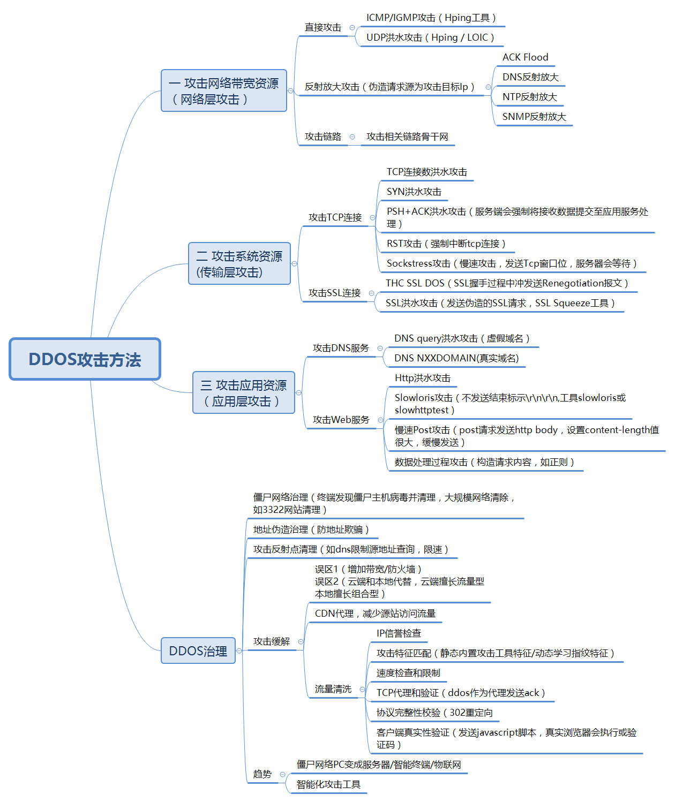

# DDoS防护

## DDoS攻击与防护总结

* DDoS攻击与防护总结
  * DDoS攻击及对策
    * 
  * DDoS攻击方法和治理
    * 
  * DDoS攻击与防御技术
    * 

## DDoS防护产品

### 阿里云 游戏盾

* 阿里云 游戏盾
  * 一句话描述：阿里云针对游戏行业面对的DDoS、CC攻击推出的针对性的网络安全解决方案
    * 谁开发的：阿里云
    * 针对什么：DDoS、CC攻击
    * 适用行业：游戏行业
    * 什么东西：网络安全解决方案
  * 目的：
    * 帮助游戏行业用户用更低的成本缓解超大流量攻击和CC攻击
      * 解决以往的攻防框架中资源不对等的问题
  * 对比
    * 高防IP
      * 防护成本更低，效果更好
        * 除了能针对大型DDoS攻击（T级别）进行有效防御外
        * 还具备彻底解决游戏行业特有的TCP协议的CC攻击问题能力
    * 与传统单点防御DDoS防御方案相比
      * 游戏盾用数据和算法来实现智能调度，将“正常玩家”流量和“黑客攻击”流量快速分流至不同的节点，最大限度缓解大流量攻击；
      * 通过端到端加密，让模拟用户行为的小流量攻击也无法到达客户端
      * 同时
        * 在传统防御中，黑客很容易锁定攻击目标IP，在攻击过程中受损非常小。
        * 而游戏盾的智能调度和识别
          * 可让用户“隐形”，让黑客“显形”
            * 每一次攻击都会让黑客受损一次，攻击设备和肉鸡不再重复可用。
        * 颠覆以往DDoS攻防资源不对等的状况
  * 架构和原理
    * 游戏盾防御DDoS攻击的原理
      * 
    * 游戏盾防御CC攻击的原理
      * 
  * 客户应用举例
    * DDoS攻击防护
      * 
    * CC攻击防护
      * 
    * 链路监测
      * 
    * 拥塞调度
      * 
    * 全网加速
      * 

### 极御

[极御云安全(StopDDoS)](https://www.stopddos.cn/)是一家专业的`云安全服务商`。其也有一些抗DDoS的产品：

* 攻击防护产品
  * [抗D云WAF](https://www.stopddos.cn/product/xwaf)
    * 下一代Web类业务DDoS防御服务，自研云甲DDoS清洗系统，DDoS清洗中心覆盖全球主要国家，千万级CC攻击防御能力，让您的业务固若金汤
  * [云御游戏盾](https://www.stopddos.cn/product/shield)
    * 专为在线游戏打造的终极DDoS防御服务，多种DDoS清洗算法和规则，端云联动，无损清洗DDoS攻击，Anycast近源清洗和加速网络保障游戏丝滑流畅
  * [抗D高防IP](https://www.stopddos.cn/product/xip)
    * 专为 TCP 业务优化的 DDoS 防御服务，可防御游戏CC攻击，全网10Tb防御能力，随时应对大型DDoS攻击
  * 高防服务器
    * 极具性价比的DDoS防御解决方案，集群化的DDoS防御能力，为个人和小型游戏提供DDoS安全防御服务
