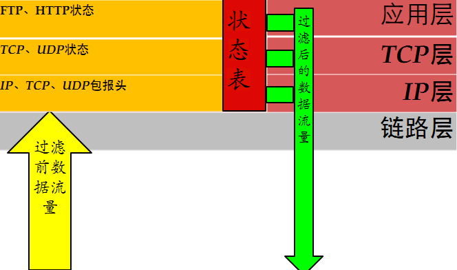

# 防火墙

* `防火墙`=`Firewall`
  * 定义：在两个信任程度不同的网络之间设置的、用于加强访问控制的软硬件保护措施
  * 基本逻辑：隔绝内外网
    * 
  * 作用
    * 防火墙能够强化安全策略，能够有效记录因特网上的活动，限制暴露用户点，是一个安全策略检查站
  * 缺点
    * 防外而不防内
    * 管理和配置复杂度较高
      * 如果配置不当容易导致安全漏洞
    * 很难为用户在防火墙内外提供一致的安全策略
    * 是一种粗粒度的访问控制
  * 历史
    * 
      * `UTM`=`Universal Threat Management`=`统一威胁管理`
        * 整合了防火墙、入侵检测、入侵保护、防病毒、防垃圾邮件等综合功能
      * 新一代的应用层防火墙 = `IPS`
  * 种类
    * 按防护类型分
      * 传统防火墙
      * 应用层防火墙
      * 防DDoS攻击防火墙
      * 垃圾信息过滤防火墙
  * 发展动态和趋势
    * 更强的性能
    * 可扩展的结构和功能
      * 缓存加速
      * 统一认证接口
      * 防`DDoS`
      * 路由器
    * 尽可能的简化安装和管理
    * 积极适应持续变化的网络安全环境
      * 防病毒和黑客
      * 反垃圾信息
        * 垃圾邮件
        * 垃圾短信
        * 垃圾电话
  * 产品
    * 开源
      * Endian
      * ModSecurity
      * SmoothWall
      * pfSense
      * iptables
      * m0n0wall
    * 商业
      * Juniper
      * 华为
      * 思科
      * 联想网御神州
      * 绿盟
      * Safe3
  * 配置和应用
    * 模式
      * `路由模式`
        * 概述
          * 防火墙的各个安全区域位于不同的网段且防火墙自身有 IP 地址。子网之间的相互访问控制被隔离
        * 架构
          * 
      * `透明模式`
        * 别称：`网桥模式`
        * 概述
          * 只区分内部网络和外部网络。不需要对防火墙进行 IP 设置。内网用户意识不到防火墙的存在，隐蔽性较好。降低了用户管理的复杂性
        * 架构
          * 
      * `混合模式`
        * 概述
          * 混合了路由模式和透明模式
          * 在实际生活中应用比较广泛
          * 在混合模式中，内网和服务器区域是透明模式，与外网间则是路由模式
        * 架构
          * 

## 防火墙关键技术

### 包过滤技术

* 包过滤技术
  * 逻辑架构
    * 
  * 检查数据包的报头信息，依照过滤规则进行过滤
    * 检查数据包内容
      * `IP`：源 IP 地址、目的 IP 地址、协议类型，选项字段等
      * `TCP`：源端口、目标端口、标志段等
      * `UDP`：源端口、目标端口
      * `ICMP`：类型
  * 优点
    * 不需要内部网络用户做任何配置
      * 对用户来说是完全透明的
    * 过滤速度快，效率高
  * 缺点
    * 不能进行数据内容级别的访问控制
    * 一些应用协议也并不适合用数据报过滤
      * 并且过滤规则的配置比较复杂，容易产生冲突和漏洞

### 状态检测技术

* 状态检测技术
  * 逻辑架构
    * 
  * 检测逻辑
    * 从收到的数据包中提取状态信息，并根据状态表进行判断
        * 规则
          * 如果该包属于已建立的连接状态，则跳过包过滤的规则检测直接交由内网主机
          * 如果不是已建立的连接状态，则对其进行包过滤，依照规则进行操作
        * 状态表
          * 状态检测技术为每一个会话连接建立状态信息，并对其维护，利用这些状态信息对数据包进行过滤
          * 状态表是动态建立的，可以实现对一些复杂协议建立的临时端口进行有效的管理
            * `动态状态表`是状态检测防火墙的核心，利用其可以实现比包过滤防火墙更强的控制访问能力
    * 状态检测技术基本流程图
      * 
    * 缺点
      * 没有对数据包内容进行检测
        * 不能进行数据内容级别的控制
      * 由于允许外网主机与内网主机直接连接，增加了内网主机被外部攻击者直接攻击的风险

### 代理服务技术

* 代理服务技术
  * 应用级代理 逻辑
    * 
  * 检测逻辑
    * 当接收到客户端发出的连接请求后，应用代理检查客户的源和目的 IP 地址，并依据事先设定的过滤规则决定是否允许该连接请求
      * 如果允许该连接请求，进行客户身份识别
      * 否则，则阻断该连接请求
    * 通过身份识别后，应用代理建立该连接请求的连接，并根据过滤规则传递和过滤该连接之间的通信数据
    * 当关闭连接后，应用代理关闭对应的另一方连接，并将这次的连接记录在日志内
  * 举例
    * Telnet
      * 
  * 优点
    * 内部网络的拓扑、IP 地址等被代理防火墙屏蔽，能有效实现内外网络的隔离
    * 具有强鉴别和细粒度日志能力
      * 支持用户身份识别，实现用户级的安全
    * 能进行数据内容的检查
      * 实现基于内容的过滤，对通信进行严密的监控
  * 缺点
    * 性能低，速度慢
      * 代理服务的额外处理请求降低了过滤性能，导致其过滤速度比包过滤器处理速度慢
    * 需要为每一种应用服务编写代理软件模块，提供的服务数目有限
    * 对操作系统的依赖程度高，容易因操作系统和应用软件的缺陷而受到攻击

