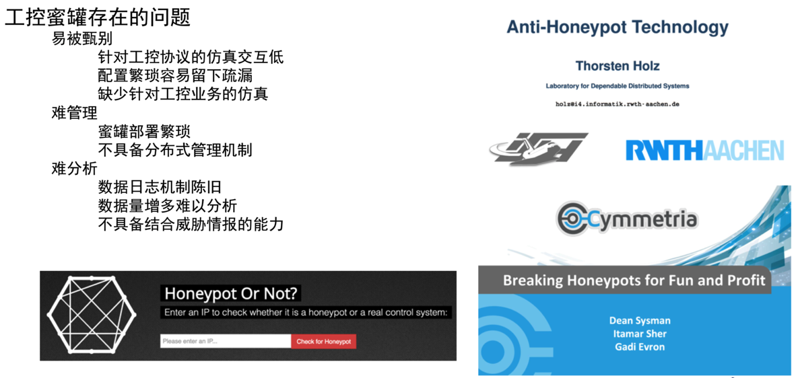

# 蜜罐HonyPot

* `蜜罐`=`Honeypot`
  * 别称：蜜网
  * 含义：高仿真、高交互的专用工业入侵诱捕系统
    * 可以理解为：网络攻防领域的钓鱼执法
  * 作用：专指用来侦测或抵御未经授权操作或者是黑客攻击的陷阱，因原理类似诱捕昆虫的蜜罐因而得名
  * 特点：发现未知攻击的有效工具
  * 举例
    * 通过Shodan搜索国外蜜罐
      * 
  * 基本架构
    * 
  * 发展历史
    * 蜜罐技术的发展里程碑
      * 1990年：小说《The Cuckoo's Egg》发表，蜜罐的概念第一次出现在公众视野
      * 1997年：Fred Cohen 发布 DTK 项目，一个用于模拟网络服务的虚拟系统，这是第一个公开的蜜罐系统
      * 2000年：蜜网项目组成立，同时发布了 Gen II 蜜网项目，在这个项目中，真实系统被用于蜜罐用途
  * 经典蜜罐项目
    * `DTK`=`Deception Toolkit`
      * Fred Cohen 等⼈于1997年首次对外公开发布，提供⼀些欺骗的⼿段（⼯具）来阻⽌攻击，是低交互蜜罐的雏形，支持简单的脚本编程自定义交互行为
    * `Honeyd`
      * 搭建虚拟蜜罐与蜜罐⽹络的轻量级守护进程，模拟⼏乎任何类型的应用层服务与任何发⾏版的操作系统，例如：IIS、FTP、telnet 等。属于低交互蜜罐，支持脚本定制和配置。建议运⾏在沙盒环境中，例如可以通过 systrace 来监控蜜罐中的 API 调用和文件 IO 等行为
    * `Nepenthes`=`猪笼草`
      * Georg Wicherski 独立开发 mwcollect，Paul Baecher 和 Markus Koetter 开发了 Nepenthes。2006 年 2 月 mwcollect 被整合进 Nepenthes，mwcollected v4 的开发得到了卡巴斯基实验室资助（2009.2-2010.1）。这同样是一个运⾏在 Linux 上的低交互虚拟蜜罐，可以模拟多种 Windows 服务，自动下载恶意代码并发送到预定义服务器进⾏集中检测和分析
    * `Dionaea`
      * 起始于 2009 年的 Nepenthes 后继项目，设计用于诱捕恶意攻击，得到恶意程序样本。属于低交互式蜜罐，支持分布式诱捕和与其他模块协同，如 p0f
  * 存在问题
    * 
