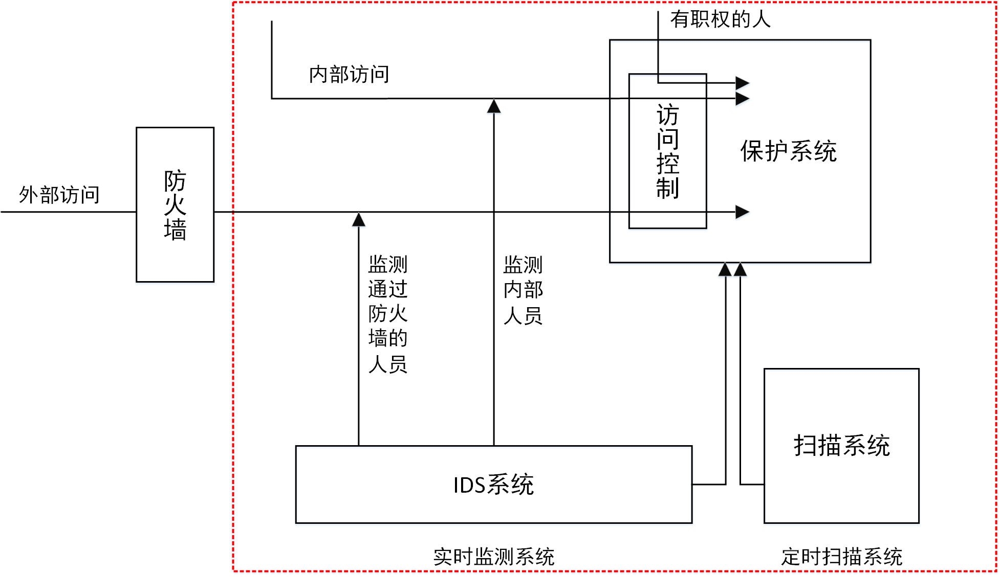

# IDS

* `IDS`=`Intrusion Detection System`=`入侵检测系统`
  * 入侵检测
    * 发展简史
      * 
  * 入侵检测系统的作用
    * 

## 入侵检测标准化

* 入侵检测标准化
  * `HIDS`=`Host-based Intrusion Detection System`=`基于主机的入侵检测系统`
  * `DIDS`=`Distributed Intrusion Detection System`=`分布式入侵检测系统`
  * `IDES`=`Intrusion Detection Expert System`=`入侵检测专家系统`
    * `NG-IDES`=`Next Generation IDES`=`下一代入侵检测专家系统`
  * `NIDS`=`Network Intrusion Detection System`=`基于网络的入侵检测系统`
  * `NSM`=`Network Security Monitor`=`网络安全监测`
  * `GrIDS`=`Graph-based Intrusion Detection System`=`基于图的入侵检测系统`
  * `CIDF`=`Common Intrusion Detection Framework`=`通用入侵检测框架`
    * 是什么：`DARPA`为`IDS`数据交据交换而作出的一个尝试
      * `DARPA`=`美国国防高级研究项目局`
    * 作用和目的
      * 定义了IDS表达检测信息的标准语言以及IDS组件之间的通信协议
        * `IDMEF`=`Intrusion Detection Message Exchange Format`=`入侵检测消息交换格式`=`RFC 4765`
        * `IDMER`=`Intrusion Detection Message Exchange Requirements`=`入侵检测消息交换要求`=`RFC 4766`
        * `IDXP`=`Intrusion Detection Exchange Protocol`=`入侵检测交换协议`=`RFC 4767`
      * 符合CIDF规范的IDS和安全设备可以共享检测信息，协同工作
      * 集成各种安全设备使之协同工作
        * 分布式入侵检测的基础
    * 体系结构
      * 提出了一个标准的IDS的通用模型
    * 规范语言
      * `CISL`=`Common Intrusion Specification Language`
        * 诞生于 1999 年，定义了一个用来描述各种检测信息的标准语言
        * CISL 和它的“继承者”们
          * MISP
            * 之前：`MISP`=`Malware Information Sharing Platform`=`恶意软件信息共享平台`
            * 后来（重新定位）：`Open Source Threat Intelligence and Sharing Platform`=`开源威胁情报和共享平台`
          * `IODEF`=`Incident Object Description Exchange Format`
            * [RFC 5070 IODEFv1](https://tools.ietf.org/html/rfc5070)
            * [RFC 7970 - IODEFv2](https://tools.ietf.org/html/rfc7970)
          * [RFC 4765](https://tools.ietf.org/html/rfc4765)=`IDMEF`=`入侵检测消息交换格式`
          * [OpenTPX - Threat Partner eXchange](https://github.com/Lookingglass/opentpx/)
            * 开源的机读威胁情报和网络操作数据交换格式和工具
          * `STIX`=`Structured Threat Information eXpression`
            * [OASIS Cyber Threat Intelligence (CTI) TC | OASIS](https://www.oasis-open.org/committees/tc_home.php?wg_abbrev=cti)
          * `Sigma`：Generic Signature Format for SIEM Systems
            * https://github.com/Neo23x0/sigma
          * `YARA`：恶意软件特征匹配描述语言和工具
            * https://github.com/virustotal/yara
    * 内部通讯
      * 定义了IDS组件之间进行通信的标准协议
    * 程序接口
      * 提供了一整套标准的应用程序接口（API函数）

## 入侵检测系统的部署

* 入侵检测系统的部署
  * 

## 入侵检测 vs 威胁检测

* `入侵`=`intrusion`
  * 本意：an occasion when someone **goes into** a place or situation where they are not wanted or expected to be
* `威胁`=`threat`
  * 本意：a suggestion that something unpleasant or violent **will happen**, especially if a particular action or order is not followed
* 从「入侵」检测到「威胁」检测
  * 检测范围扩大
    * `入侵` 检测强调在能区分**内外网**的场景下，重点关注**从外到内**的攻击行为
    * `威胁` 检测不区分**内外网**
  * 检测时间提前
    * `入侵` 检测强调检测**已经发生**的攻击行为
    * `威胁` 检测强调预防**尚未发生**的攻击事件发生
  * 检测目标扩充
    * `入侵` 检测虽然在最早的术语定义中是包含**滥用**行为的，但在实际研究和产品落地实现时主流 IDS 依然以**狭义**的漏洞利用行为检测为主
    * `威胁` 检测的目标不再有遗漏：`攻击`、`滥用`、`恶意代码`等等一网打尽
  * 自动化和协作共享防御目标没有变化

