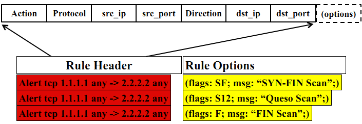
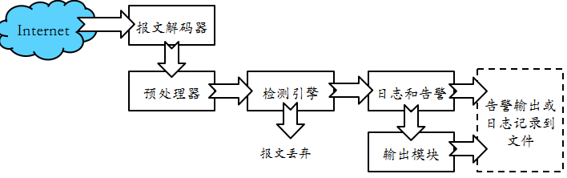

# Sonrt

* `Sonrt`
  * 轻量级的网络入侵检测系统
  * 特点
    * 轻巧
      * 源代码不到1MB
    * 多平台=移植性高
      * 支持Linux, Windows, MacOS X, Solaris, BSD, IRIX, Tru64, HP-UX等平台
    * 高性能
      * 使用百兆网络线速处理
    * 可配置
      * 使用简单的规则语言，丰富的日志/配置分析工具
    * 免费
      * GPL 开源
  * 原理
    * 基于Libpcap 的报文嗅探接口
    * 基于规则的检测引擎和支持无限扩展的插件系统
    * 检测引擎
    * 基于指纹的规则
      * 采用模块化设计
      * 具有丰富的检测能力（内置规则）
        * 可进行隐蔽扫描，操作系统识别扫描,、缓冲区溢出攻击、后门和CGI漏洞利用等
  * 工作模式
    * 嗅探模式
    * 报文记录模式
    * `NIDS`模式
  * 图
    * 捕获的数据报文
      * 
    * Sonrt规则
      * 支持多种规则
        * 
      * Sonrt规则格式
        * 
    * Sonrt流程
      * 
    * Sonrt架构
      * 

## Snort简史

* Snort简史
  * Snort 最早是由 Martin Roesch 在 1998 年用 C 语言开发
  * 2001 年应众多 Snort 商业化需求，Martin Roesch 创建了公司 Sourcefire
  * 2013 年 10 月，思科收购了 Sourcefire 并主导 Snort 的开源项目
    * 以 Snort 核心代码和订阅规则为基础，开发了商业版的防火墙、入侵检测等设备与服务并持续回馈到 Snort 开源项目

## OpenAppID

* `OpenAppID`
  * 一句话描述
    * OpenAppId is an open, application-focused detection language and processing module for Snort that enables users to create, share, and implement application and service detection
      * 思科收购 Sourcefire 之后发布的 Snort 新衍生项目
        * 解决网络流量的「深度识别」需求之一：识别产生流量的具体关联应用
  * 兼容 Snort2 和 Snort3

## Snort3 / Snort++

* 思科在 2013 年收购了 Snort 的母公司之后，于 2014 年发布了用 C++ 语言重写的 Snort3 Alpha ，又被称为 Snort++
* 相比于 Snort2 ，Snort3 的产品定位从 IDS 悄然变为 IPS(Intrusion Prevention System)
* 相比于 Snort2 的 主要变化 如下：
  * 支持多线程报文处理
  * 配置简化，支持脚本编程
  * 核心组件的插件化
