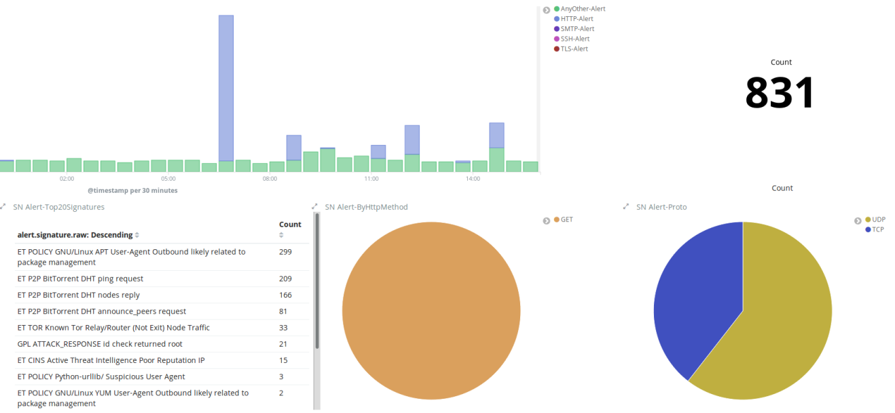

# Suricata

* `Suricata`
  * 是什么：Suricata 是`OISF`主导和支持的一个免费、开源、成熟、高性能和健壮的网络威胁检测引擎
    * `OISF`=`Open Information Security Foundation`=`非盈利性组织开放信息安全基金会`
  * 功能
    * 实时入侵检测
    * 内联
      * IPS
        * `IPS`=`Intrusion Prevention System`=`入侵保护`
      * NSM
        * `NSM`=`Network Security Monitoring`=`网络安全监控`
    * 离线pcap处理
  * 介绍
    * Suricata 使用可扩展的规则和签名语言来检查网络，流量，支持使用Lua脚本语言检测复杂威胁。
    * Suricata 使用标准 YAML 输入格式和 JSON 输出格式，使得和第三方`SIEM`工具（例如`Splunk`、`ELK`和其他数据库）集成十分容易
      * `SIEM`=`Security Information and Event Management`=`安全信息和事件管理`
  * 图
    * Suricata产生的报警日志可视化效果图
      * 

