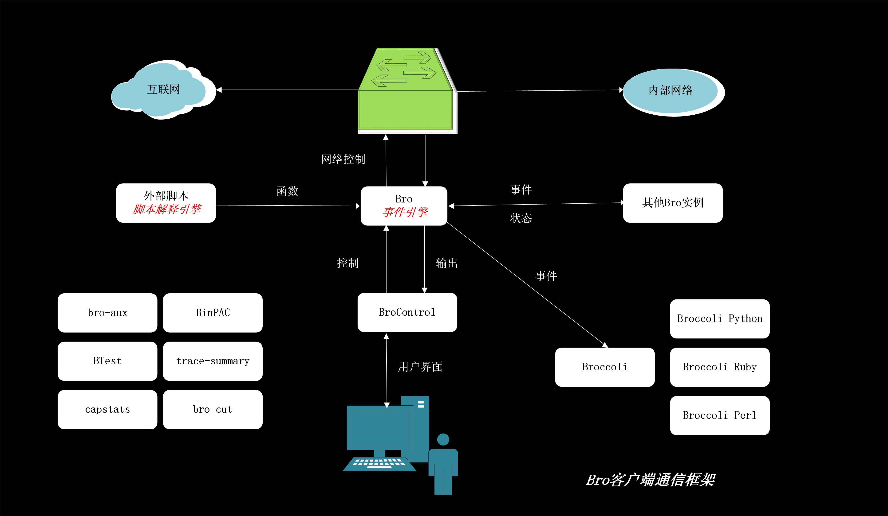

# Zeek

* `Zeek`
  * 旧：`Bro`
  * 资料
    * 文档
      * Get Started — Book of Zeek (v4.0.1)
        * https://docs.zeek.org/en/lts/get-started.htmls
  * 主要特性
    * 部署
      * 运行在普通硬件和标准UNIX系统（包括 Linux, FreeBSD, MacOS）
      * 基于网络流量分流或镜像端口方式的完全被动流量分析
      * 基于标准 libpcap 接口捕获数据报文
      * 实时和离线分析
      * 支持大规模集群部署
      * 同时支持单机和集群配置的统一管理框架
      * 基于 BSD 协议开源
    * 分析
      * 全面行为日志记录用于离线分析和取证
      * 端口无关的应用层协议分析
      * 支持多种应用层协议（包括：DNS、FTP、HTTP、IRC、SMTP、SSH、SSL）
      * 应用层负载内容分析包括 MD5/SHA1 计算用于指纹
      * 完全 IPv6 支持
      * 隧道协议检测和分析（包括 Ayiya, Teredo, GTPv1）。Zeek 重组识别的隧道协议负载就像没有使用隧道协议一样去分析内层应用层协议数据。
      * 协议分析期间支持大量合法性检查方法
      * 支持 IDS 风格的模式匹配
    * 可编程性
      * 使用图灵完备语言来完成任意分析任务的表达刻画
      * 基于事件编程模型
      * 内置专业领域数据结构支持，例如 IP 地址（IPv4 和 IPv6 地址透明处理）、端口号和时钟
      * 广泛支持基于时间（窗口）的追踪和网络状态管理
    * 接口
      * 默认输出为格式化后的 ASCII 日志
      * 可选后端支持 ElasticSearch 和数据序列。更多数据库接口仍在开发中。
      * 支持外部数据实时导入集成分析。实时数据库仍在开发中。
      * 外部C语言编程库用于 Zeek 事件和外部程序交换。支持 Perl、Python 和 Ruby 语言混编。
      * 支持从脚本语言调用任何外部可执行程序。
  * 架构
    * 
    * 主要组件
      * 事件引擎（核心）
      * 脚本解释引擎
    * 集群架构拓扑图
      * 
  * 对比
    * Zeek 相比较于 Snort 和 Suricata 具有以下独特特性
      * 可扩展性。同时支持单机和集群配置的统一管理框架，这使得我们所做的系统不会局限于原型演示系统，可以随时在流量采集这个需求上实现快速扩展；
      * 全面行为日志记录用于离线分析和取证，特别是这些日志还可以实时输出为 ASCII 格式文本文件，我们可以很方便的把这些日志实时导入到一个实时日志分析引擎进行二次分析。结合主机和设备日志、情景数据和威胁情报，为关联分析提供了必要的来源输入数据；
      * 可编程性，使得我们可以按需实时对网络流量进行就近在线分析和关键信息抽取，可以随时根据系统架构中不同组件的实现方案进行灵活适配，满足系统总体架构设计需求。
