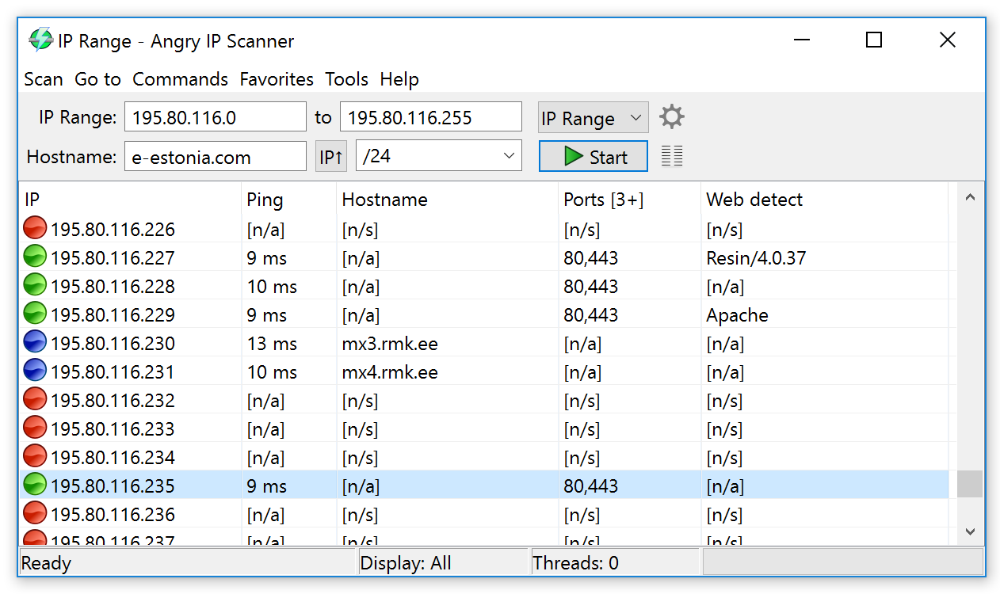
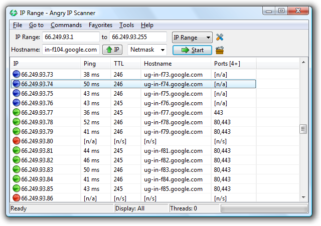
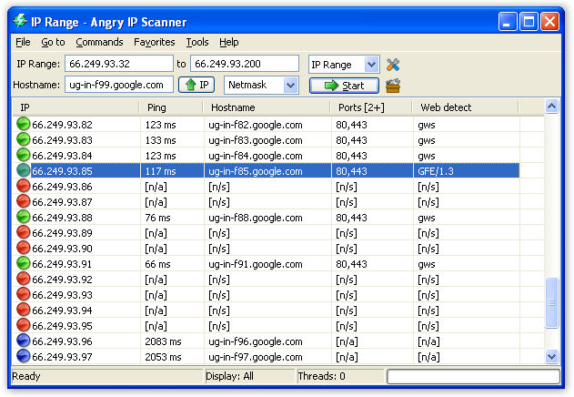
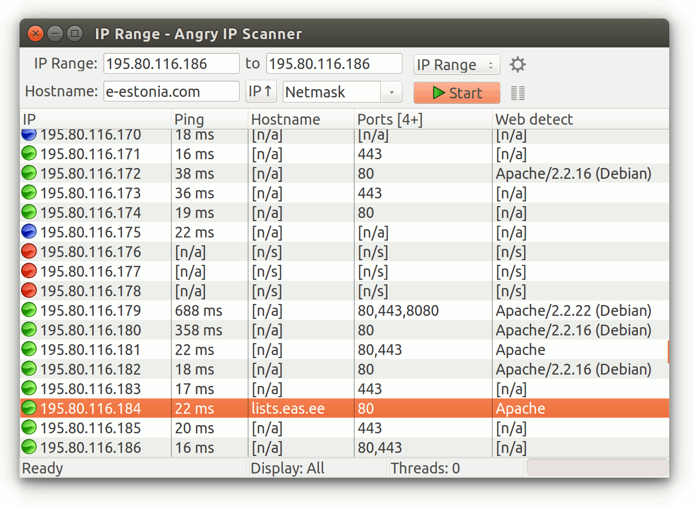
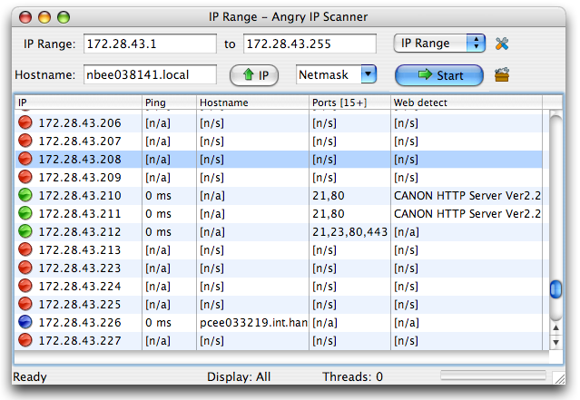
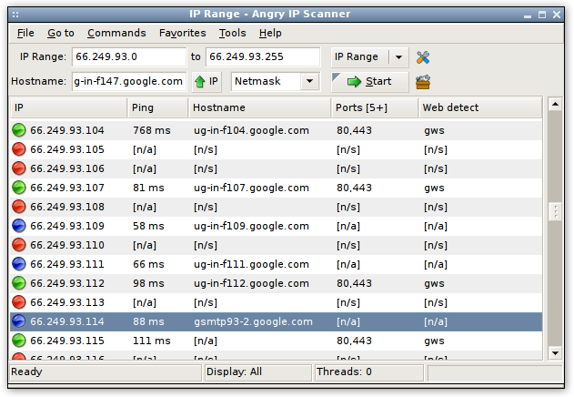

# Angry IP Scanner

* `Angry IP Scanner`
  * 别称：`ipscan`
  * 是什么：一个开源的跨平台的网络扫描工具
  * 设计宗旨：速度快，易用
  * 概述
    * 一种轻量级IP扫描工具，使用多线程扫描技术快速扫描，结果能够保存到CSV, TXT, XML 或 IP-Port 列表文件中。基于Java的灵活框架，并且能够通过插件扩展额外信息收集功能
  * 图
    * Windows
      * Windows 10
        * 
      * Windows 7/Vista
        * 
      * Windows XP
        * 
    * Ubuntu
      * 
    * Older Mac OS X
      * 
    * Older Linux
      * 
