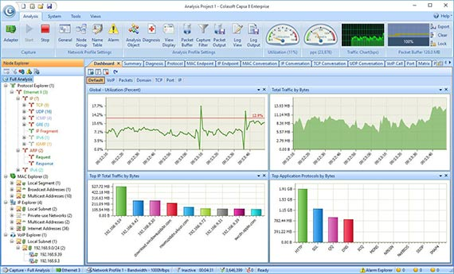
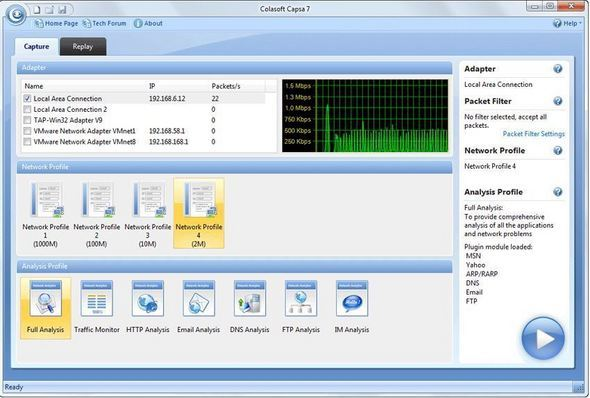

# Capsa Free

* `Capsa Free`=`Capsa Free Network Analyzer`
  * 概述
    * 网络分析工具，用于监控、故障排除和分析。来自Colasoft的Capsa Free提供了识别和监控超过300种不同协议的能力。用户可以记录网络配置文件，创建定制报告和设置自定义报警触发条件。此外，Capsa提供邮件监控，自动保存邮件内容以及易于使用的TCP时序图
  * 图
    * 
    * 
