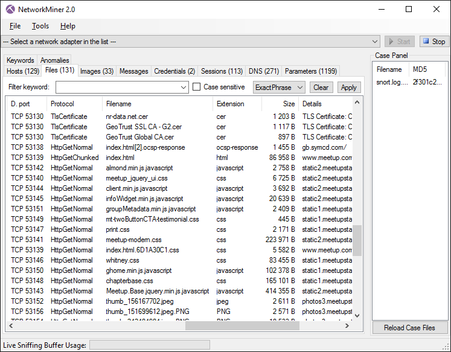
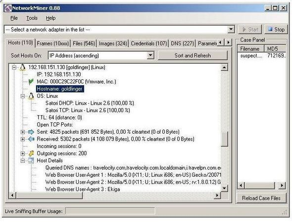

# NetworkMiner

* `NetworkMiner`
  * 一句话描述：一个开源的网络取证分析工具
  * Logo
    * 
  * 概述
    * 有时，不仅需要分析网络流量。软件安全公司Netresec 的NetworkMiner是一种基于Windows的网络取证分析工具，设计用来收集有关网络中的主机和数据，而非流量。它能够抓包甚至解析PCAP文件，以帮助用户监测网络中主机的OS,主机名，以及开放端口。此工具方便文件、证书的重组传输，而无需耗费额外的流量
  * 功能
    * 在线online
      * 应用领域
        * 网络取证分析=`Network Forensic Analysis`
        * 被动的网络嗅探=`passive network sniff`
        * 抓包=`packet capturing`
      * 用于分析
        * 操作系统operating systems
        * 会话sessions
        * 主机名hostnames
        * 开放端口open ports
    * 离线offline
      * 解析`PCAP`文件
        * 用于重新生成/汇编成要发送的文件和证书
  * 图
    * 
    * 
    * 
