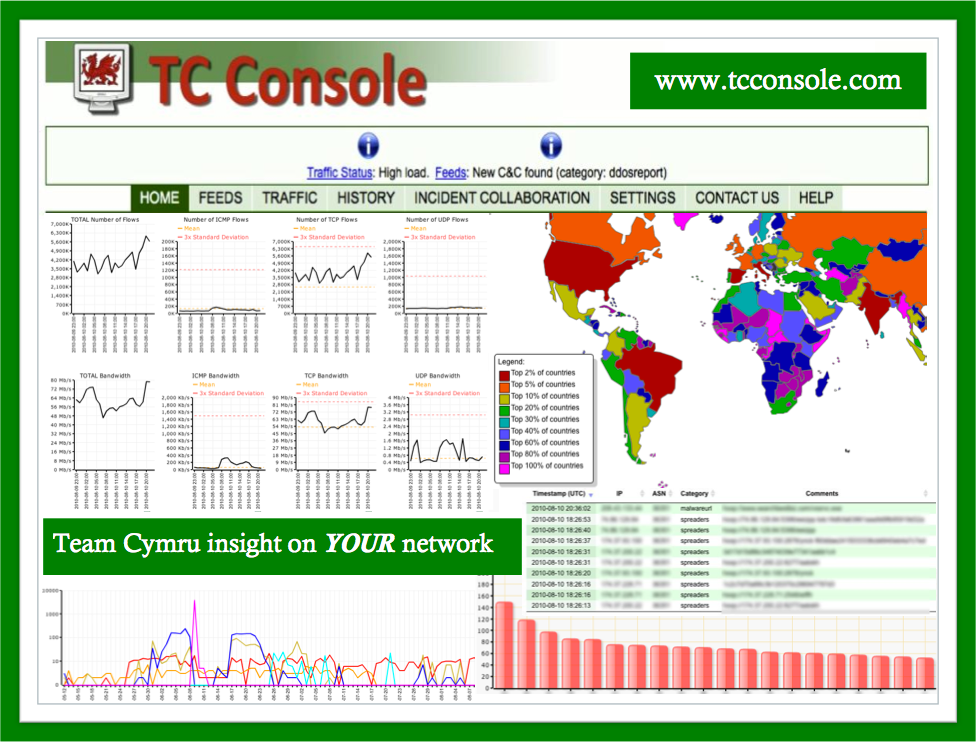
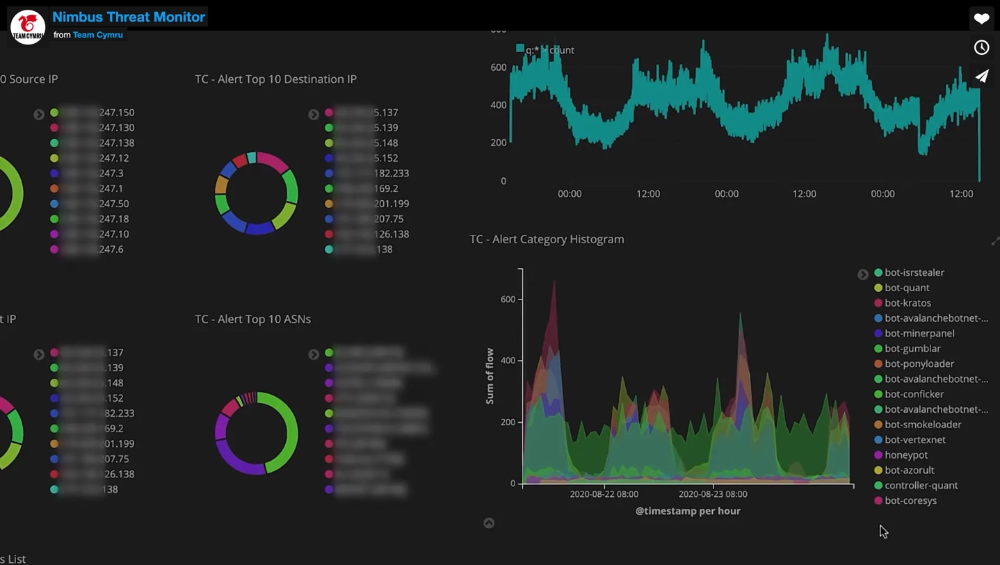
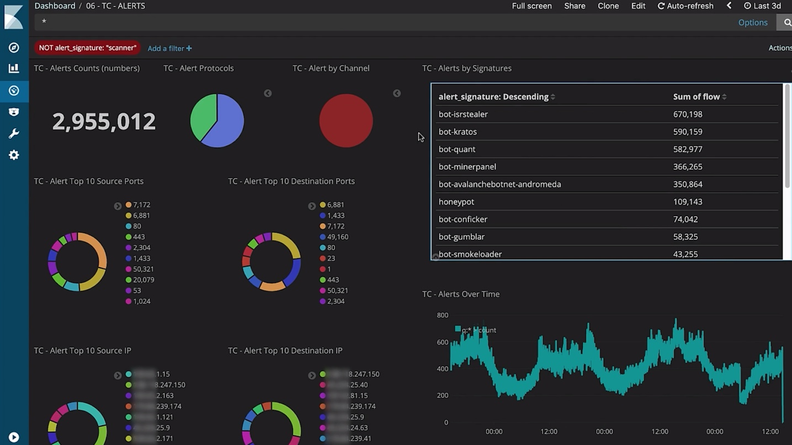

# Nimbus Threat Monitor

* `Nimbus Threat Monitor`
  * 旧称：`TC Console`
  * 主页
    * [Nimbus Threat Monitor - Team Cymru](https://team-cymru.com/community-services/nimbus-threat-monitor/)
  * 概述
    * 此工具极大推进了网络可视化。由非盈利性安全研究公司 Team Cymru提供，TC Concole提供网络恶意行为的历史视图，以及网络通信数据，交叉比对该组织收集的全球关于恶意行为的统计数据。该工具免费，但只有愿意与Team Cymru数据库分享网络信息的组织才能获得
  * 图
    * 旧：TC Console
      * 
    * 新：Nimbus Threat Monitor
      * 
      * 
