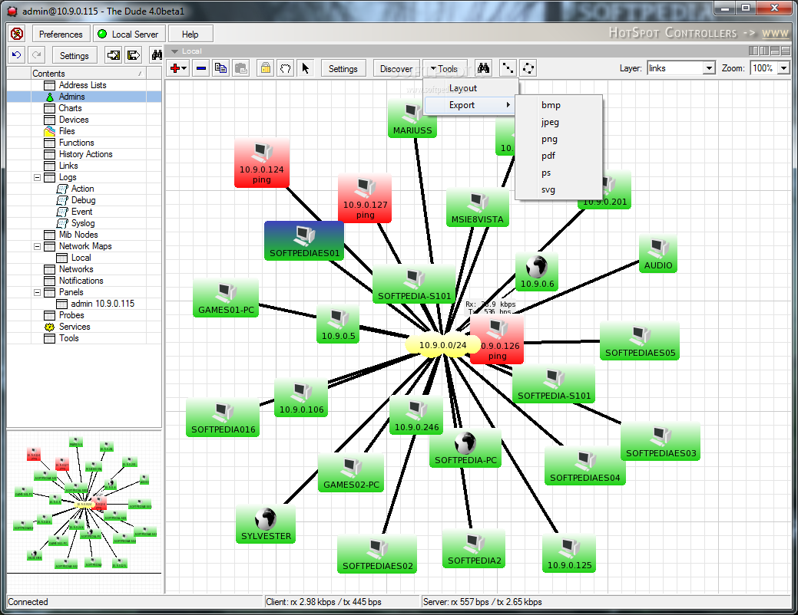
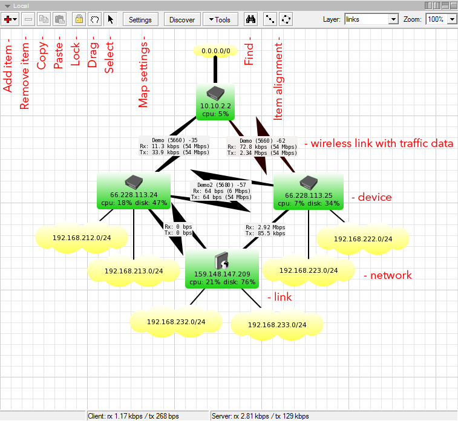
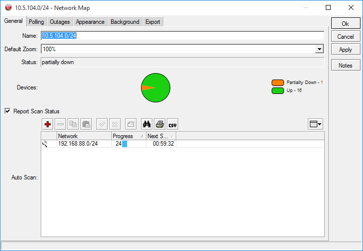
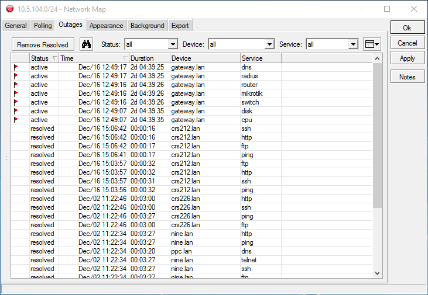

# The Dude

* `The Dude`
  * 是什么：网络监控器network monitor
  * 作用：极大地提高你管理网络的效率
    * 主要是可以画出内网的网络关系图，可视化后，方便理解和管理设备
  * 概述
    * 在指定子网内自动扫描设备。The Dude能够绘制网络地图，监控运行设备的服务器并在服务器有问题时自动告警。能够运行在Windows，Linux Wine, Darwine和MacOS，并支持设备的SNMP, ICMP, DNS 和 TCP 监控
  * 功能
    * 自动扫描内网所有设备
    * 画出网络结构布局图
    * 监控设备服务
    * 服务异常报警
    * 不仅可以监控（设备），还可以管理（设备）
  * 图
    * 
    * 
    * 
    * 
