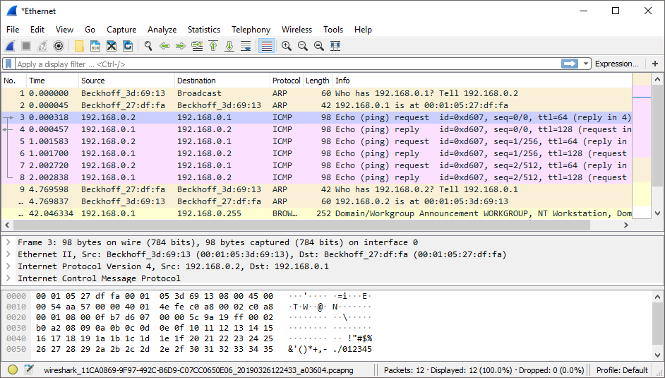
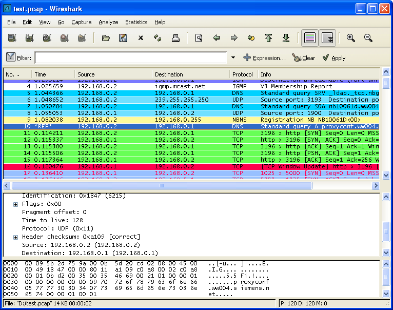
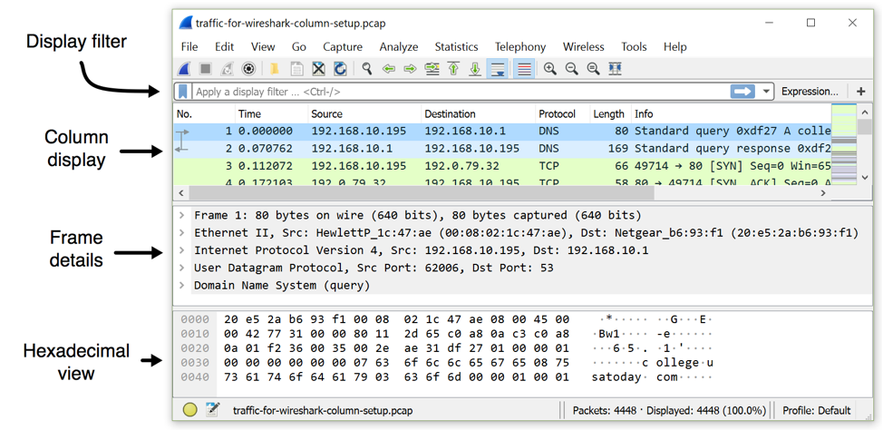
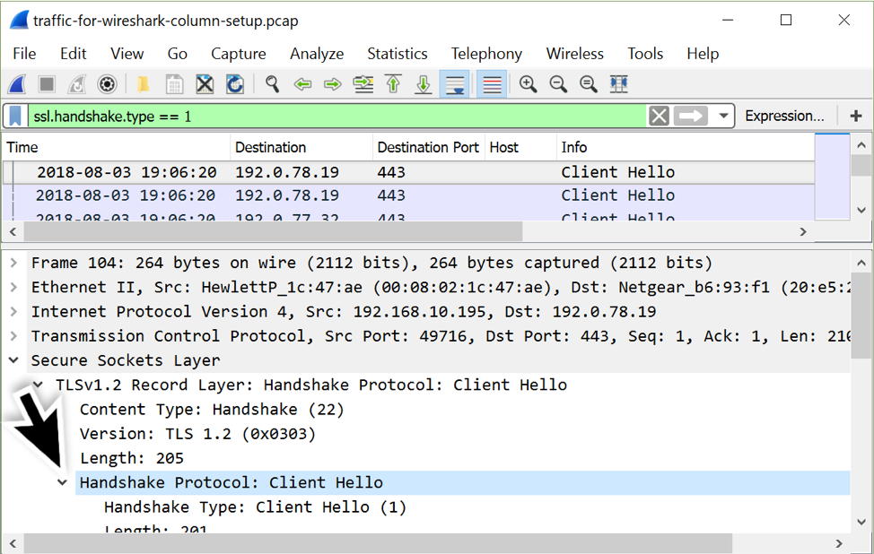
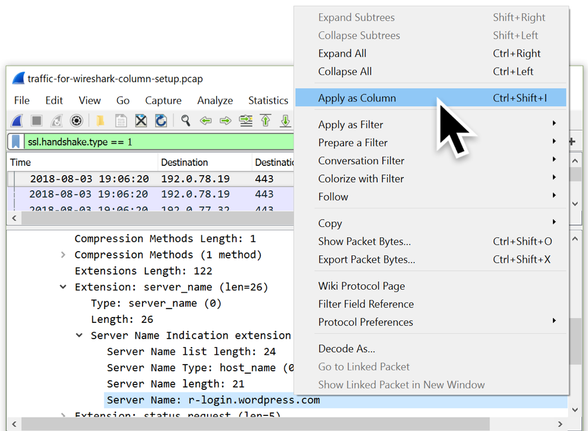

# Wireshark

* `Wireshark`
  * 一句话描述：最流行的网络协议分析工具，主要用于网络数据包分析
  * 概述
    * Wireshark是一种网络协议分析工具，使用户能够深入分析网络活动，涵盖上百种协议以及各主要平台，包括Windows, Linux, OS X, Solaris, FreeBSD 和 NetBSD。数十种抓包文件格式的读写功能，通过GUI或TTY-mode浏览数据
  * 图
    * 
    * 
    * 
    * 
    * 
  * 功能特点
    * Deep inspection of hundreds of protocols, with more being added all the time
    * Live capture and offline analysis
    * Standard three-pane packet browser
    * Multi-platform: Runs on Windows, Linux, macOS, Solaris, FreeBSD, NetBSD, and many others
    * Captured network data can be browsed via a GUI, or via the TTY-mode TShark utility
    * The most powerful display filters in the industry
    * Rich VoIP analysis
    * Read/write many different capture file formats: tcpdump (libpcap), Pcap NG, Catapult DCT2000, Cisco Secure IDS iplog, Microsoft Network Monitor, Network General Sniffer® (compressed and uncompressed), Sniffer® Pro, and NetXray®, Network Instruments Observer, NetScreen snoop, Novell LANalyzer, RADCOM WAN/LAN Analyzer, Shomiti/Finisar Surveyor, Tektronix K12xx, Visual Networks Visual UpTime, WildPackets EtherPeek/TokenPeek/AiroPeek, and many others
    * Capture files compressed with gzip can be decompressed on the fly
    * Live data can be read from Ethernet, IEEE 802.11, PPP/HDLC, ATM, Bluetooth, USB, Token Ring, Frame Relay, FDDI, and others (depending on your platform)
    * Decryption support for many protocols, including IPsec, ISAKMP, Kerberos, SNMPv3, SSL/TLS, WEP, and WPA/WPA2
    * Coloring rules can be applied to the packet list for quick, intuitive analysis
    * Output can be exported to XML, PostScript®, CSV, or plain text
  * 