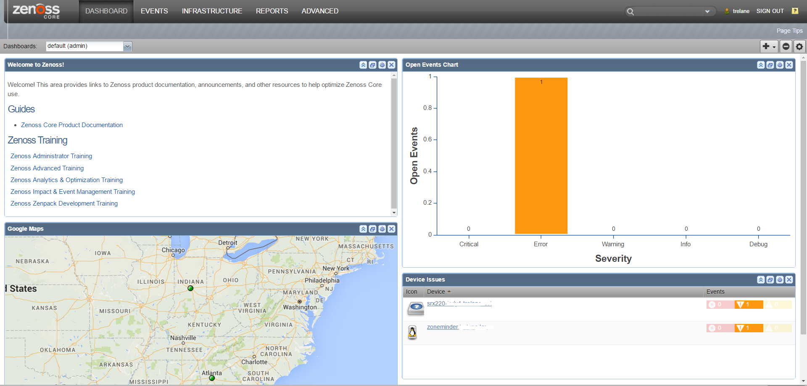
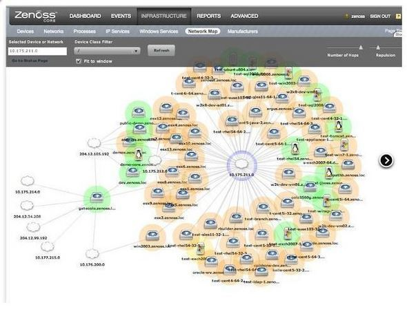

# Zenoss Core

* `Zenoss Core` = `Zenoss Community Edition`
  * 是什么：一个网络管理平台
    * 基于`Zope`的应用服务器
    * 通过Web页面提供服务
  * 概述
    * 一个集成的网络和系统管理平台，Zenoss Core具备可用性，性能，事件，系统和网络设备配置的监控能力。随着数据流通过SNMP，SSH，WMI，JMX和Syslog，该平台提供了灵活的监控日志和事件管理。此外，该工具针对虚拟和云基础架构，包括VMware ESX，提供专门的监控功能
  * 图
    * 
    * 
