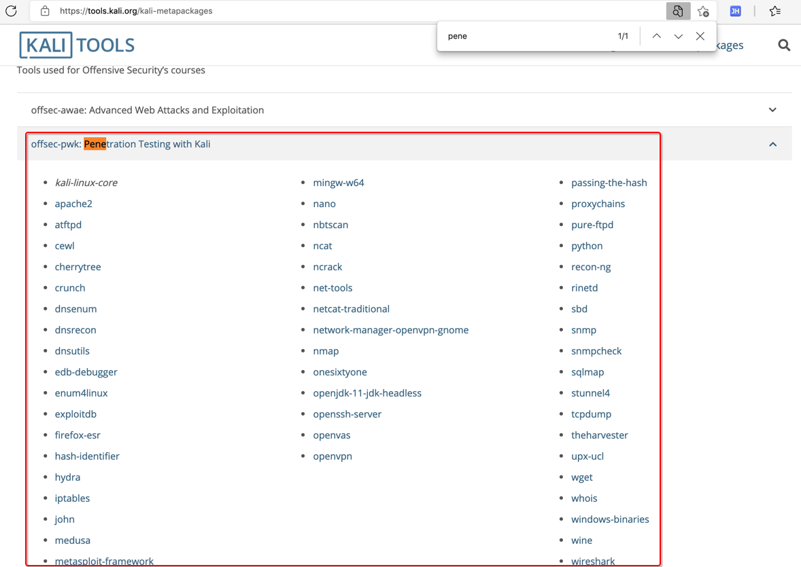
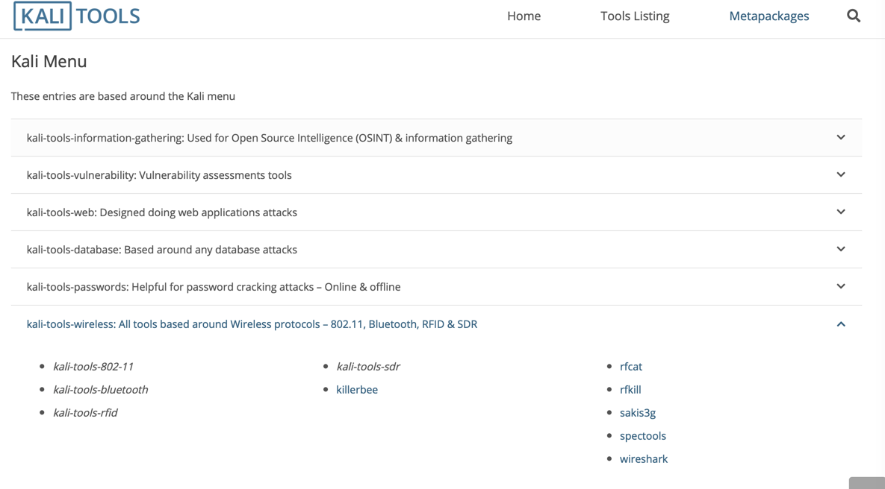
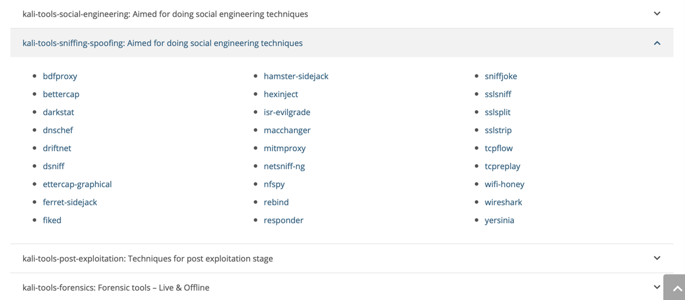
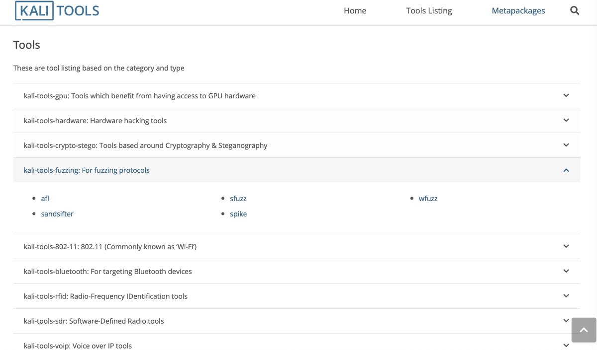

# Kali Linux

  * =`Kali Linux`
  * 是什么：一个Linux操作系统，专门用于渗透测试，

* `Kali`
  * =`Kali Linux`
    * 旧称：`BackTrack Linux`
  * 是什么：一个操作系统
    * 用途：专门用于安全、逆向、破解、渗透
    * 特点：自带大量相关工具
  * 被称为
    * 网络安全人员的专用系统
  * 资料
    * 主页
      * Kali Linux | Penetration Testing and Ethical Hacking Linux Distribution
        * https://www.kali.org
  * 其他方面对Kali的支持
    * Hopper Disassembler
      * Hopper - Download
        * https://www.hopperapp.com/download.html?
          * 专门提供Kali Linux的zip压缩包

## Kali中的工具

* Kali中的工具
  * 首页
    * Penetration Testing Tools - Kali Linux
      * https://tools.kali.org
    * Kali Linux Tools Listing | Penetration Testing Tools
      * https://tools.kali.org/tools-listing

### 根据用途分

* Kali Metapackages
  * Kali Metapackages | Penetration Testing Tools
    * https://tools.kali.org/kali-metapackages
      * Metapackages 目的是方便你，根据自己的用途，安装特定领域的工具
        * 可以根据自己的需要，去找对应领域或用途的工具
  * 举例
    * 渗透测试 Penetration Test
      * 
    * 无线 Wireless
      * 
    * 嗅探 Sniff
      * 
    * 模糊测试 Fuzz
      * 

### 根据不同类型分

* 根据不同分类
  * Information Gathering
    * ace-voip
    * Amap
    * APT2
    * arp-scan
    * Automater
    * bing-ip2hosts
    * braa
    * CaseFile
    * CDPSnarf
    * cisco-torch
    * copy-router-config
    * DMitry
    * dnmap
    * dnsenum
    * dnsmap
    * DNSRecon
    * dnstracer
    * dnswalk
    * DotDotPwn
    * enum4linux
    * enumIAX
    * EyeWitness
    * Faraday
    * Fierce
    * Firewalk
    * fragroute
    * fragrouter
    * Ghost Phisher
    * GoLismero
    * goofile
    * hping3
    * ident-user-enum
    * InSpy
    * InTrace
    * iSMTP
    * lbd
    * Maltego Teeth
    * masscan
    * Metagoofil
    * Miranda
    * nbtscan-unixwiz
    * Nikto
    * Nmap
    * ntop
    * OSRFramework
    * p0f
    * Parsero
    * Recon-ng
    * SET
    * SMBMap
    * smtp-user-enum
    * snmp-check
    * SPARTA
    * sslcaudit
    * SSLsplit
    * sslstrip
    * SSLyze
    * Sublist3r
    * THC-IPV6
    * theHarvester
    * TLSSLed
    * twofi
    * Unicornscan
    * URLCrazy
    * Wireshark
    * WOL-E
    * Xplico
  * Vulnerability Analysis
    * BBQSQL
    * BED
    * cisco-auditing-tool
    * cisco-global-exploiter
    * cisco-ocs
    * cisco-torch
    * copy-router-config
    * Doona
    * DotDotPwn
    * HexorBase
    * jSQL Injection
    * Lynis
    * Nmap
    * ohrwurm
    * openvas
    * Oscanner
    * Powerfuzzer
    * sfuzz
    * SidGuesser
    * SIPArmyKnife
    * sqlmap
    * Sqlninja
    * sqlsus
    * THC-IPV6
    * tnscmd10g
    * unix-privesc-check
    * Yersinia
  * Exploitation Tools
    * Armitage
    * Backdoor Factory
    * BeEF
    * cisco-auditing-tool
    * cisco-global-exploiter
    * cisco-ocs
    * cisco-torch
    * Commix
    * crackle
    * exploitdb
    * jboss-autopwn
    * Linux Exploit Suggester
    * Maltego Teeth
    * Metasploit Framework
    * MSFPC
    * RouterSploit
    * SET
    * ShellNoob
    * sqlmap
    * THC-IPV6
    * Yersinia
  * Wireless Attacks
    * Airbase-ng
    * Aircrack-ng
    * Airdecap-ng and Airdecloak-ng
    * Aireplay-ng
    * airgraph-ng
    * Airmon-ng
    * Airodump-ng
    * airodump-ng-oui-update
    * Airolib-ng
    * Airserv-ng
    * Airtun-ng
    * Asleap
    * Besside-ng
    * Bluelog
    * BlueMaho
    * Bluepot
    * BlueRanger
    * Bluesnarfer
    * Bully
    * coWPAtty
    * crackle
    * eapmd5pass
    * Easside-ng
    * Fern Wifi Cracker
    * FreeRADIUS-WPE
    * Ghost Phisher
    * GISKismet
    * Gqrx
    * gr-scan
    * hostapd-wpe
    * ivstools
    * kalibrate-rtl
    * KillerBee
    * Kismet
    * makeivs-ng
    * mdk3
    * mfcuk
    * mfoc
    * mfterm
    * Multimon-NG
    * Packetforge-ng
    * PixieWPS
    * Pyrit
    * Reaver
    * redfang
    * RTLSDR Scanner
    * Spooftooph
    * Tkiptun-ng
    * Wesside-ng
    * Wifi Honey
    * wifiphisher
    * Wifitap
    * Wifite
    * wpaclean
  * Forensics Tools=取证工具
    * Binwalk
    * bulk-extractor
    * Capstone
    * chntpw
    * Cuckoo
    * dc3dd
    * ddrescue
    * DFF
    * diStorm3
    * Dumpzilla
    * extundelete
    * Foremost
    * Galleta
    * Guymager
    * iPhone Backup Analyzer
    * p0f
    * pdf-parser
    * pdfid
    * pdgmail
    * peepdf
    * RegRipper
    * Volatility
    * Xplico
  * Web Applications
    * apache-users
    * Arachni
    * BBQSQL
    * BlindElephant
    * Burp Suite
    * CutyCapt
    * DAVTest
    * deblaze
    * DIRB
    * DirBuster
    * fimap
    * FunkLoad
    * Gobuster
    * Grabber
    * hURL
    * jboss-autopwn
    * joomscan
    * jSQL Injection
    * Maltego Teeth
    * Nikto
    * PadBuster
    * Paros
    * Parsero
    * plecost
    * Powerfuzzer
    * ProxyStrike
    * Recon-ng
    * Skipfish
    * sqlmap
    * Sqlninja
    * sqlsus
    * ua-tester
    * Uniscan
    * w3af
    * WebScarab
    * Webshag
    * WebSlayer
    * WebSploit
    * Wfuzz
    * WhatWeb
    * WPScan
    * XSSer
    * zaproxy
  * Stress Testing
    * DHCPig
    * FunkLoad
    * iaxflood
    * Inundator
    * inviteflood
    * ipv6-toolkit
    * mdk3
    * Reaver
    * rtpflood
    * SlowHTTPTest
    * t50
    * Termineter
    * THC-IPV6
    * THC-SSL-DOS
  * Sniffing & Spoofing
    * bettercap
    * Burp Suite
    * DNSChef
    * fiked
    * hamster-sidejack
    * HexInject
    * iaxflood
    * inviteflood
    * iSMTP
    * isr-evilgrade
    * mitmproxy
    * ohrwurm
    * protos-sip
    * rebind
    * responder
    * rtpbreak
    * rtpinsertsound
    * rtpmixsound
    * sctpscan
    * SIPArmyKnife
    * SIPp
    * SIPVicious
    * SniffJoke
    * SSLsplit
    * sslstrip
    * THC-IPV6
    * VoIPHopper
    * WebScarab
    * Wifi Honey
    * Wireshark
    * xspy
    * Yersinia
    * zaproxy
  * Password Attacks
    * BruteSpray
    * Burp Suite
    * CeWL
    * chntpw
    * cisco-auditing-tool
    * CmosPwd
    * creddump
    * crowbar
    * crunch
    * findmyhash
    * gpp-decrypt
    * hash-identifier
    * Hashcat
    * HexorBase
    * THC-Hydra
    * John the Ripper
    * Johnny
    * keimpx
    * Maltego Teeth
    * Maskprocessor
    * multiforcer
    * Ncrack
    * oclgausscrack
    * ophcrack
    * PACK
    * patator
    * phrasendrescher
    * polenum
    * RainbowCrack
    * rcracki-mt
    * RSMangler
    * SecLists
    * SQLdict
    * Statsprocessor
    * THC-pptp-bruter
    * TrueCrack
    * WebScarab
    * wordlists
    * zaproxy
  * Maintaining Access
    * CryptCat
    * Cymothoa
    * dbd
    * dns2tcp
    * HTTPTunnel
    * Intersect
    * Nishang
    * polenum
    * PowerSploit
    * pwnat
    * RidEnum
    * sbd
    * shellter
    * U3-Pwn
    * Webshells
    * Weevely
    * Winexe
  * Hardware Hacking
    * android-sdk
    * apktool
    * Arduino
    * dex2jar
    * Sakis3G
    * smali
  * Reverse Engineering
    * apktool
    * dex2jar
    * diStorm3
    * edb-debugger
    * jad
    * javasnoop
    * JD-GUI
    * OllyDbg
    * smali
    * Valgrind
    * YARA
  * Reporting Tools
    * CaseFile
    * cherrytree
    * CutyCapt
    * dos2unix
    * Dradis
    * MagicTree
    * Metagoofil
    * Nipper-ng
    * pipal
    * RDPY
