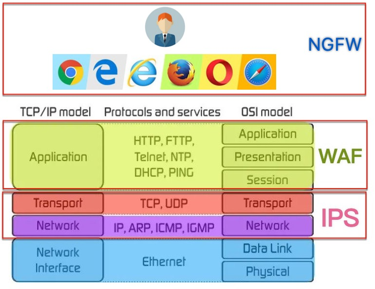

# WAF

* `WAF`=`Web Application Firewall`=`网络应用防火墙`
  * 是什么：`AF`=`应用防火墙`的一种，用于过滤、监控、阻止来自和去向Web服务的（有害的）HTTP流量
  * 具体形式：WAF不拘泥于形式，可以是
    * `软件`
    * `硬件`（设备）
    * （云端的）`服务` = SaaS
  * 背景：针对应用发起的攻击成为造成网络漏洞的主要原因
  * 作用：WAF帮你拦截一系列企图通过入侵系统来泄漏数据的攻击
  * 目的：保护Web应用免受各类应用层攻击
    * 比如SQL注入、XSS、文件包含、cookie中毒、不当的系统配置等
  * 历史
    * WAF产品
      * `Perfecto`的`AppShield`：主要用于电商
      * `ModSecurity`：开源项目
        * 先：基于`WAS TC`去制定保护规则
          * `WAS TC`=OASIS `Web Application Security Technical Committee`
        * 后：基于`OWASP`的`Top 10`去制定规则
        * `OWASP`=`Open Web Application Security Project`
      * 侧重防信用卡诈骗
        * 相关标准
          * `PCI DSS`=`Payment Card Industry Data Security Standard`
  * 现状
    * Web应用已成攻击者首要目标
    * 以硬件设备形式实现的传统WAF不足以提供全面的应用控制和可见性
    * 基于云的新时代WAF可以提供足够的Web防护
      * 交付安全投资的真正价值
  * 工作原理
    * WAF通过过滤、监控和拦截恶意`HTTP`或`HTTPS`流量对Web应用的访问来保护您的Web应用，并能够阻止未经授权的数据离开应用
    * 为此，WAF需要遵守一套`策略`=`policy`，帮助其确定哪些流量是恶意的，哪些流量是安全的
    * WAF的操作方式与代理服务器类似，虽然同为“中介”，但后者旨在保护客户端身份，前者却被称为反向代理，因为其使命在于保护 Web 应用服务器免受潜在恶意客户端的影响
    * 策略可定制，以满足您对Web应用或Web应用组合的独特需求。虽然许多WAF要求您定期更新策略以解决新的漏洞，但机器学习的进步使一些WAF能够自动更新。随着威胁环境愈发复杂和不确定，这种自动化变得越来越重要
  * 注意
    * WAF并不是最终的完整的安全方案，一般搭配其他安全相关系统一起使用，比如`网络防火墙`=`Network Firewall`、`IPS`=`Intrusion Prevention System`=`入侵防护系统`，以打造一套完整的安全防护体系
  * 部署方式
    * 基于云 + 完全托管即服务
      * 如果您需要以最快、最便捷的方式将WAF引入您的应用（特别是在您的内部安全或IT资源有限的情况下），这是一个很好的选择。
    * 基于云 + 自我管理
      * 获享基于云的完整灵活性和安全策略的可移植性，同时仍然保留对流量管理和安全策略设置的可控性。
    * 基于云 + 自动配置
      * 开启最简单的云端WAF使用方式，并能够以一种轻松、经济的方式部署安全策略。
    * 内部 Advanced WAF（虚拟或硬件设备）
      * 满足最苛刻的部署要求，一次解决灵活性、性能和更高级的安全问题等多项核心任务

## 对比

### `WAF` vs `IPS` vs `NGFW`

* `WAF` vs `IPS` vs `NGFW`
  * 名词
    * `WAF`=`Web应用防火墙`
    * `IPS`=`入侵防御系统`
    * `NGFW`=`下一代防火墙`
  * 区别
    * 概述
      * 
        * `IPS`：侧重**协议传输层**（`OSI`的`3`、`4`层）
        * `WAF`：侧重**应用层**（`OSI`的`5`、`6`、`7`层）
        * `NGFW`：侧重**Web应用**（`浏览器`、`邮件`、`SaaS`等）
    * 详解
      * IPS 是一款目标范围更加广泛的安全产品
        * IPS 通常以签名和策略为基础
        * 换言之，它可以根据签名数据库和既定策略，检查众所周知的漏洞和攻击载体
        * IPS 根据数据库和策略建立一个标准，然后会在流量偏离标准时发出警报
        * 随着时间的推移，新漏洞层出不穷，签名和策略也会积少成多
        * 一般来说，IPS 保护对象是一系列协议类型的流量，例如 DNS、SMTP、TELNET、RDP、SSH 和 FTP
        * 通常情况下，IPS 会运行于第 3 层和第 4 层并对其提供保护，相较于网络层和会话层，对应用层（第 7 层）提供的保护力度着实有限
      * WAF的设计则专为保护应用层而生
        * 旨在分析应用层上各 HTTP 或 HTTPS 请求
        * 它通常会感知用户、会话和应用，了解其背后的 Web 应用及其提供的服务
        * 正因如此，WAF 可以看作是用户和应用之间的中介，并会提前对往来于两者之前的通信进行分析
        * 传统的 WAF 确保仅执行允许的操作（基于安全策略）
        * 对于许多组织来说，WAF 是应用值得信赖的第一道防线，尤其是在抵御 OWASP 十大漏洞方面
      * NGFW可以监控进入互联网的流量，覆盖网站、电子邮件账户和 SaaS
        * 简单地说，它是在保护用户（相对于 Web 应用）
        * NGFW 将强制执行基于用户的策略，并为安全策略添加上下文，此外还添加了 URL 过滤、防病毒或防恶意软件等功能，并有可能添加自己的IPS。WAF 是典型的反向代理（供服务器使用），而 NGFW 通常是正向代理（供浏览器等客户端使用）
